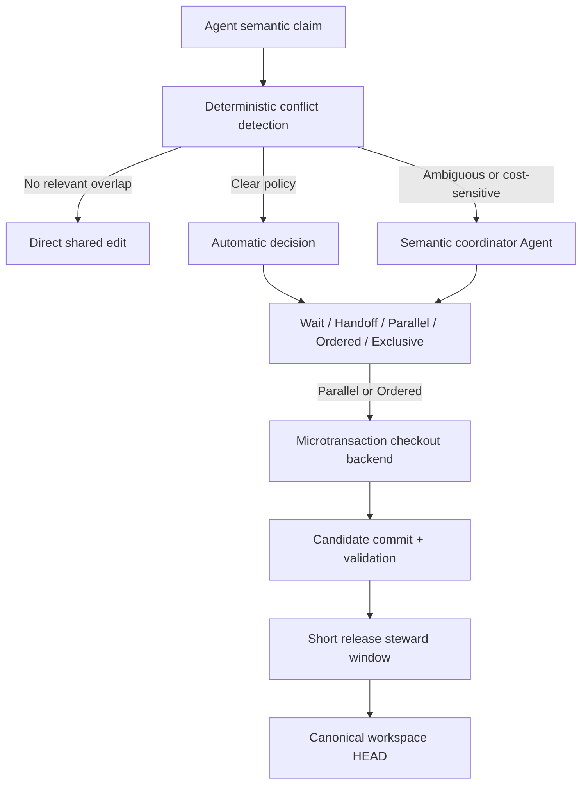
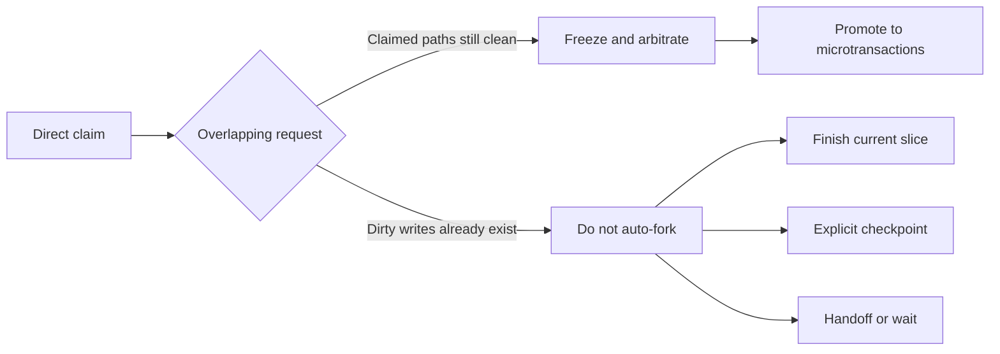
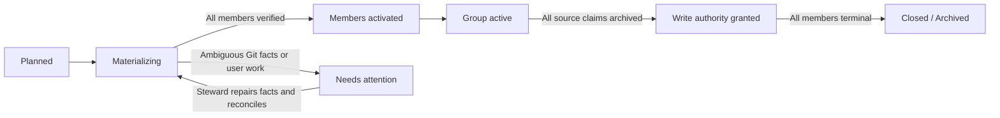
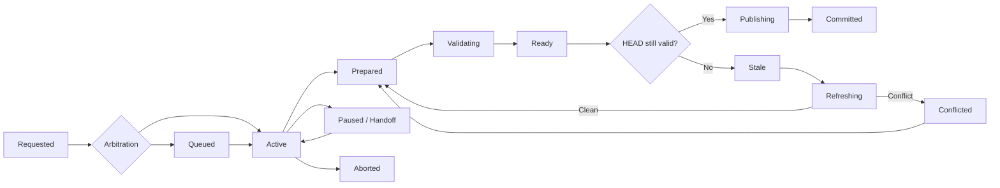
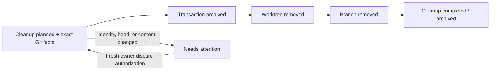
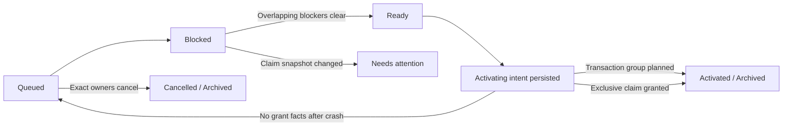
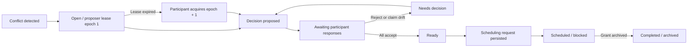

# Shared Workspace Semantic Microtransactions

- 状态：阶段六 hardening 已实现，覆盖外部共享资源与授权阻断
- 日期：2026-08-06
- 暂定中文名：争用触发的语义微事务
- 暂定英文名：Contention-Triggered Semantic Microtransactions

## 目录

1. [摘要](#1-摘要)
2. [背景与问题](#2-背景与问题)
3. [目标与非目标](#3-目标与非目标)
4. [规范用语](#4-规范用语)
5. [核心原则与不变量](#5-核心原则与不变量)
6. [术语](#6-术语)
7. [系统架构](#7-系统架构)
8. [Semantic claim](#8-semantic-claim)
9. [仲裁模型](#9-仲裁模型)
10. [Direct claim 升级](#10-direct-claim-升级)
11. [Transaction 状态机](#11-transaction-状态机)
12. [GitWorktreeBackend](#12-gitworktreebackend)
13. [Validation 与过期判断](#13-validation-与过期判断)
14. [共享 workspace 发布谓词](#14-共享-workspace-发布谓词)
15. [共享脏工作树的并发语义](#15-共享脏工作树的并发语义)
16. [控制平面存储](#16-控制平面存储)
17. [崩溃恢复](#17-崩溃恢复)
18. [Handoff 与连续性](#18-handoff-与连续性)
19. [可观测性与争用热点](#19-可观测性与争用热点)
20. [性能演进](#20-性能演进)
21. [安全边界](#21-安全边界)
22. [概念接口](#22-概念接口)
23. [典型流程](#23-典型流程)
24. [第一版实施范围](#24-第一版实施范围)
25. [验收场景](#25-验收场景)
26. [已确定的设计决策](#26-已确定的设计决策)
27. [实现阶段可调参数](#27-实现阶段可调参数)
28. [当前实现状态](#28-当前实现状态)

## 1. 摘要

本文定义一种面向多 Agent 共享代码仓库的并发协作模型。所有 Agent 默认在同一个
canonical workspace 中工作；只有当多个写入申请发生局部争用，且协调器判断并发收益高于
等待成本时，系统才为冲突范围创建短生命周期的 Git microtransaction。

microtransaction 绑定一次小型语义修改，不绑定 Agent 的完整任务。它从当前共享 `HEAD`
创建临时 branch 和 shadow checkout，在隔离位置完成修改、验证和必要的 rebase，随后由唯一
发布者以 fast-forward 方式推进共享 `HEAD`，并立即销毁临时资源。

该模型组合以下能力：

- Git commit 提供不可变版本快照；
- linked worktree 提供当前可用的临时物理隔离；
- semantic claim 描述物理写集、语义写集和失效依赖；
- 冲突发现者默认成为该争用切片的临时协调 proposer；
- contention-local lease 与 fencing epoch 允许安全换届，不转移代码所有权；
- 确定性协调器负责状态转换、范围检查、Git 操作和恢复；
- 共享 index/HEAD 只在最终发布窗口内短暂串行化；
- 高频争用被视为架构或任务拆分问题，而不是自动合并能力不足。

第一版不修改 Git，不引入虚拟文件系统，也不给每个 Agent 创建长期 workspace。checkout
后端保持可替换，以便未来迁移到 sparse checkout、独立 index、overlay 或 VFS。

## 2. 背景与问题

现有共享工作区协调主要采用路径 claim、等待、handoff 和短时 Git steward。它能避免两个
Agent 无意覆盖对方的修改，但对路径重叠倾向于悲观串行化。

路径重叠不等于语义冲突。例如，两个 Agent 可能分别向同一个路由表文件添加 `/health`
和 `/metrics`，或者分别修改同一文件中的不同函数。这些工作具有相同物理写路径，但语义
写集不同，可以并行开发并依次快速发布。

传统人类开发通常使用按开发者或 feature 划分的长寿命分支。分支持续时间越长，与主线的
语义和文本漂移越大，最终合并成本越高。Agent 工作应被拆成更小、更独立的语义切片，因此
更适合使用按争用窗口创建、完成即销毁的临时分支。

本设计要解决的不是“自动合并所有冲突”，而是：

1. 无争用时保持共享编辑的低开销；
2. 偶发局部争用时允许安全、短时的并行开发；
3. 把可能冲突的 refresh/rebase 限制在 shadow checkout；
4. 让共享 workspace 始终保持可继续工作的状态；
5. 用争用数据识别不健康的代码边界和任务拆分。

## 3. 目标与非目标

### 3.1 目标

- 保留单一共享 canonical workspace 和 canonical branch；
- 默认使用 direct claim，不为无冲突工作创建 branch 或 checkout；
- 在 claim 冲突时先仲裁，再决定等待、handoff、并行、排序或独占；
- 将临时 branch 的生命周期限制为一次小型语义修改；
- 支持同文件、不同语义单元的并发开发；
- 支持可以并行开发但必须按序发布的 speculative work；
- 支持重构、移动、删除、公共契约和生成物的严格独占；
- 允许共享 workspace 存在不相关的 unstaged dirty files；
- 确保冲突解决不会污染共享 index 或工作树；
- 绑定 validation evidence、candidate commit 和 canonical base；
- 支持 owner handoff、崩溃恢复和非破坏性清理；
- 暴露持续争用热点并触发结构审查；
- 让无冲突 fast path 接近现有 claim 成本。

### 3.2 非目标

第一版明确不提供：

- 每个 Agent 一个永久 workspace；
- 长寿命 feature branch 管理；
- 任意 Git 冲突的自动语义解决；
- 操作系统级强制文件写入隔离；
- 跨主机或跨仓库的分布式原子事务；
- 自动 takeover 失联 owner 的修改；
- 修改 Git 内核或实现虚拟文件系统；
- 把所有读取过的文件记录为完整数据库式 read set；
- 通过更多自动合并掩盖持续的架构争用。

## 4. 规范用语

本文中的“必须”表示正确性或安全性要求；“应该”表示默认策略，只有记录明确理由后才可
偏离；“可以”表示可选能力。

## 5. 核心原则与不变量

### 5.1 默认共享，按需隔离

无冲突工作必须继续在共享 workspace 中直接进行。transaction 是路径或语义争用的一种解决
结果，不是 Agent 开始工作时的默认容器。

### 5.2 事务绑定语义切片，不绑定 Agent

一个 Agent 可以在任务执行期间依次创建多个 microtransaction，也可以完全不创建。一个
microtransaction 应只覆盖一个可快速验证、可独立发布的 semantic delta。

### 5.3 并行开发与串行发布分离

多个 transaction 可以同时 active，但共享 canonical `HEAD` 的推进必须串行。允许并行不
意味着允许无序发布；ordered transaction 必须遵守依赖顺序。

### 5.4 发布单位是原子 commit

transaction 可以涉及一个或多个文件，但正式发布形态应该是一个原子语义 commit。不得通过
覆盖共享文件来“push 文件”，否则会丢失跨文件不变量和来源信息。

### 5.5 冲突只在 shadow checkout 中解决

可能失败的 rebase、patch replay 或冲突解决不得发生在共享 workspace。共享 workspace 只
接收已经能够从当前 `HEAD` fast-forward 的候选 commit。

### 5.6 过期不是 takeover 授权

时间戳、心跳缺失和 TTL 只提供诊断信息。未发布修改只有 owner、明确 handoff 或用户授权
才能转移或删除。

### 5.7 高频争用是设计信号

反复争用必须形成可见的 contention signal，用于模块边界、公共 facade、生成流程或 Agent
任务拆分审查。

## 6. 术语

**Canonical workspace**

所有 Agent 默认共享的仓库工作树。其当前分支和 `HEAD` 表示已发布公共上下文。

**Direct claim**

Agent 在 canonical workspace 直接修改某个语义范围的临时写入权限。

**Semantic claim**

包含任务、意图、物理写路径、语义写资源和失效依赖的工作申请。

**Microtransaction**

为一次局部争用创建的短生命周期修改容器。

**Shadow checkout**

microtransaction 使用的临时物理文件视图。第一版由 Git linked worktree 实现。

**Candidate commit**

经过范围检查、准备发布的 transaction commit。

**Sensitive resource**

如果在 transaction 执行期间发生变化，就可能使实现或验证失效的路径、契约或语义资源。

**Release steward**

在短发布窗口内唯一拥有共享 Git index、HEAD 和 canonical branch 修改权限的协调者。

**Contention hotspot**

重复出现重叠申请、等待、rebase、冲突或返工的路径或语义资源。

**External shared resource**

位于 workspace 之外、但会被多个任务观察或修改的 canonical build、部署链接、生成 catalog
或其他共享输出。它必须拥有仓库定义的唯一逻辑资源键，并由物理原子锁保护最终 mutation。

**Environment or authorization blocker**

沙箱、文件系统权限、只读挂载、缺少父目录、策略或用户批准阻止操作的状态。它不是 contention，
也不能推导出存在另一个 steward。

## 7. 系统架构



### 7.1 争用级语义协调 Agent

系统不要求一个常驻中心 Agent。后到并检测出冲突的 Agent 默认成为该 contention 的 proposer，
只负责这一次局部争用：

- 判断任务是否真的独立；
- 比较等待成本与 checkout、refresh、验证和返工成本；
- 在信息不足时选择 wait、handoff、parallel、ordered 或 exclusive；
- 记录理由、影响范围和重新评估点；
- 对 semantic claim 进行补充或升级；
- 识别高争用背后的结构问题。

它不直接充当锁文件，不以模型上下文作为唯一权威状态，也不绕过确定性检查发布代码。
参与者必须确认会改变其写权限或工作形态的 decision revision。协调 lease 可以心跳、显式 handoff，
或在过期后由 contention participant 获取新的 fencing epoch；旧 epoch 不能继续写协调状态。

协调权与工作所有权严格分离。lease 过期只允许继续 proposal、ack 收集和 scheduler 驱动，不得
transfer、discard、publish 或删除任何 participant 的 claim、checkout 或未发布修改。

### 7.2 确定性协调器

负责：

- 原子写入 claim、transaction 和 event 记录；
- 标准化路径并检测物理重叠；
- 执行兼容矩阵中的明确决策；
- 管理状态转换、owner 和 publish dependency；
- 创建和回收 shadow checkout；
- 计算 actual diff；
- 验证 candidate、base 和 validation binding；
- 串行化共享 Git index/HEAD 发布；
- 执行恢复和一致性检查。

### 7.3 Git

负责 canonical 历史、immutable base、transaction branch、linked worktree、diff、rebase、
文本冲突检测和 fast-forward 发布。Git 不是语义冲突判断器；文本无冲突不代表契约、schema
或行为无冲突。

### 7.4 Checkout backend

上层协议只依赖以下逻辑接口：

```text
materialize(base, declared_scope) -> checkout_handle
inspect_diff(checkout_handle) -> actual_write_set
prepare(checkout_handle) -> candidate_commit
refresh(checkout_handle, new_base) -> refreshed_candidate | conflict
dispose(checkout_handle)
```

第一版实现为 `GitWorktreeBackend`。未来可以替换为 sparse worktree、warm worktree pool、
alternate Git index、structured patch capsule、overlay filesystem 或 VFS。transaction record
保存 opaque checkout handle，上层状态机不得依赖具体 worktree 命令。

## 8. Semantic claim

### 8.1 最小结构

```yaml
schema: 1
scope: route-health
owner: agent-a
task: Add the /health route
intent: additive
write_paths:
  - src/router.ts
  - tests/test_router.py
semantic_writes:
  - route:/health
sensitive_to:
  - contract:http-routing
  - symbol:src/router.ts#registerRoute
first_release: Health route and focused test pass
validation:
  - focused router tests
depends_on: []
```

### 8.2 必填字段

`scope` 是一次工作切片的稳定语义名称，不等于整个任务或单纯文件名。

`owner` 是当前责任方的唯一 id，友好名称与 id 分开。

`task` 用一句话描述预期行为变化。

`write_paths` 是预期写集的保守上界；除纯 `read` 外必须提供，且不得默认声明整个 workspace。

`first_release` 描述第一个可以独立验证并发布的具体边界。

`intent` 使用受限枚举：

- `read`
- `additive`
- `local-edit`
- `contract`
- `refactor`
- `move`
- `delete`
- `generated`

### 8.3 条件必填字段

当路径重叠且申请者希望并发时，必须提供 `semantic_writes`，例如：

```text
route:/health
symbol:parseConfiguration
config-key:features.new-ui
test-case:rejects-expired-token
schema-field:user.email
```

`sensitive_to` 不是所有读取过的文件，而是 transaction 正确性依赖的资源。如果这些资源
发生变化，transaction 必须重新审阅或验证。

### 8.4 可选字段

`validation` 描述预期验证责任。

`depends_on` 表示必须先发布的 scope 或 transaction。

`estimated_release` 可以提供 `immediate`、`short` 或 `long` 作为成本判断提示，但不是授权依据。

### 8.5 协调器生成字段

申请者不得自行指定 base revision、transaction id、branch、checkout path、concurrency mode、
publish order、blocker、arbitration reason、actual write set、candidate 或 validation binding。

### 8.6 范围扩张

实际修改超出声明范围时，transaction 必须暂停 prepare 并申请扩张。

- 新范围无冲突时，可以原子扩张；
- 新范围有冲突时，必须重新仲裁；
- expansion 不得在持有现有资源时进入无限等待；
- 如果不能立即扩张，owner 应缩小修改、完成当前 slice、checkpoint、handoff 或重启事务。

该规则避免两个 transaction 各自持有一部分资源并等待对方资源的 hold-and-wait 死锁。

## 9. 仲裁模型

### 9.1 冲突来源

物理冲突包括同文件、父子路径、重叠目录、rename/move 源和目标、delete 范围、生成源与产物、
submodule gitlink 和 canonical build output。

语义冲突包括同一 symbol、route、config key、schema field、API/schema writer 与消费者、
公共 contract、生成器与生成物、唯一键、注册顺序和共享 invariant。

### 9.2 仲裁结果

**direct**：无相关重叠，继续在 canonical workspace 编辑。

**wait**：当前 owner 即将到达 first release，等待成本低于 transaction 成本。

**handoff**：两项工作实质属于同一语义变化，由一个 owner 完成更经济。

**parallel-tx**：可以并行开发，原则上允许任意顺序发布。

**ordered-tx**：可以并行开发，但存在 `publish_after`，后发布者必须 refresh 和重新验证。

**exclusive**：重叠资源严格串行，无关路径仍然 direct。

### 9.3 默认兼容矩阵

| 当前工作 | 新申请 | 语义关系 | 默认结果 |
|---|---|---|---|
| `read` | 任意 | 只读快照 | 允许，不阻塞写入 |
| `additive` | `additive` | 不同单元 | `parallel-tx` |
| `additive` | `local-edit` | 不同单元 | `parallel-tx` |
| `local-edit` | `local-edit` | 不同单元 | `parallel-tx` |
| `additive/local-edit` | 同类 | 关系不确定 | 语义仲裁：`wait` 或 `ordered-tx` |
| 任意写入 | 任意写入 | 相同语义单元 | `wait` 或 `handoff` |
| `contract` | 相关消费者或写入 | 相关 | `exclusive` 或严格 `ordered-tx` |
| `refactor/move/delete` | 重叠范围 | 相关 | `exclusive` |
| `generated` | 生成源或产物 | 相关 | `exclusive` |
| 已存在脏写入 | 后到重叠申请 | 任意 | 当前 owner 优先快速完成或 checkpoint |

相同语义单元不应默认 speculative。两个 Agent 同时重写同一函数通常只会制造重复推理和返工。

### 9.4 成本决策

```text
expected_wait_cost
    >
checkout_cost
+ refresh_cost
+ revalidation_cost
+ conflict_probability * rework_cost
```

第一版不要求精确数值。协调 Agent 根据 first release 距离、任务独立性、验证成本和历史争用
做定性判断，并记录理由。

### 9.5 自动与语义决策边界

- 无物理或语义重叠：自动 `direct`；
- 明确 exclusive intent：自动排队或独占；
- 路径重叠但 semantic units 明确不同：自动 `parallel-tx`；
- 已存在重叠脏写入：默认不动态 fork；
- 关系不确定或涉及成本权衡：请求语义协调 Agent；
- 任何降低 exclusive 要求的决定都必须记录理由。

### 9.6 公平性与无死锁要求

- waiting request 本身不授予写权限，也不物化 checkout；
- 同一重叠范围按 durable sequence 执行 FIFO，无关范围可以越过；
- 较早排队的 exclusive 请求阻止新的重叠 optimistic claim、claim expansion 或 transaction
  无限插队；
- 无关资源不受 exclusive queue 影响；
- `publish_after` 必须构成无环图；
- 全部初始资源一次性原子授予；
- 资源 expansion 不能进入 hold-and-wait；
- TTL 只触发诊断，不触发自动 takeover 或删除。

### 9.7 Contention-local 选主与活性

当新 claim 因路径或语义重叠进入 `pending-arbitration` 时，确定性协调器必须同时创建或加入一个
durable contention record。冲突发现者成为初始 proposer，并获得 epoch 1 的短时 coordination
lease。该角色不是仓库级 leader，也不获得其他 owner 的数据权限。

contention record 至少保存 participants、claim digest、paths、semantic resources、当前
coordinator、epoch、lease deadline、decision revision、participant responses、request id 和状态。

- 明确兼容矩阵可以作为默认 proposal，但仍需受影响 participants 确认；
- 新 participant 加入尚未 enact 的 contention 时，旧 decision 失效并重新仲裁；
- claim digest 在 decision 后变化时，enact 必须停止，不创建 checkout；
- coordinator 主动 handoff 或 lease 过期接管都必须增加 epoch；
- 旧 epoch 的命令必须被 fencing；
- coordinator 失联可以换届，owner 失联不能自动 takeover；
- 已确认并关联 contention 的 wait request 在 blocker release 时可以被协作式推进；
- 没有确认的 pending contention 保持安全停驻并显示为 awaiting responses；lease 过期、decision
  被拒或关联 request 进入 attention 时，才进入 stalled workflow 报告。

## 10. Direct claim 升级

transaction 应尽量在重叠写入发生前创建。



升级前必须：

1. 通知现有 owner 停止对冲突范围继续写入；
2. 确认 action-required 消息已 acknowledgement；
3. 确认冲突范围在 canonical workspace 中仍然 clean；
4. 记录共同 base revision；
5. 将冲突范围从 direct 权限切换为 transaction 权限；
6. 只为获得 `parallel-tx` 或 `ordered-tx` 的请求创建 checkout。

如果现有 owner 已产生脏写入，默认让它快速完成 first release。捕获脏工作树为临时 Git tree
可以作为未来能力，但不属于第一版 fast path。

### 10.1 等待授权或环境变化

任务已经拥有 shared output 的逻辑 claim、但最终 mutation 被环境或授权边界阻止时，必须把
claim 标记为 Paused，并记录 checkpoint、blocker kind、operation、canonical resource key、稳定
error kind 和精确 resume condition。该状态继续保留逻辑资源所有权，但 owner 必须停止 mutation。

只有确认物理锁确实存在，才可以报告另一位 steward 可能正在操作。`EACCES`、`EPERM`、`EROFS`、
`ENOENT` 和 sandbox/policy denial 必须保持各自的环境分类，不创建 contention。

等待用户授权后仍计划继续的任务不得 release claim。恢复前必须重新观察物理锁、canonical target、
candidate identity 和记录的 base，并把 bounded evidence 写入 `claim-resumed`。如果 claim 已被释放，
必须重新申请相同 canonical resource；不能依赖旧授权或旧检查直接 mutation。

## 11. Transaction 状态机

### 11.1 Transaction group 激活状态机

一次仲裁产生的多个 transaction 必须先形成一个持久化 group plan。group 是物化阶段的授权
边界；单个 member 的 branch 或 checkout 已经存在，并不代表该 member 已获得写权限。



group plan 在任何 Git mutation 之前写入，包含共同 base、canonical branch、仲裁理由和每个
member 的 transaction snapshot。只有同时满足以下条件，member 才能进入正常编辑流程：

- 所有计划 branch 与 checkout 均已存在并和 record 双向匹配；
- materialization 期间所有 checkout 仍 clean、没有进行中的 Git 操作且 `HEAD == base`；
- 所有 transaction snapshot 已进入 Active；
- group snapshot 为 Active；
- 原 direct claims 已全部归档为 promoted。

这使组级激活成为显式 barrier。即使进程在逐 member 写 snapshot 时退出，`prepare`、handoff、
resume、abort 和 publish 也会拒绝尚未跨过 barrier 的 member。

如果 group 尚未跨过 claim promotion barrier，可以由 steward 发起 partial-group abort，但必须
同时提供所有 member owner 的精确确认。撤销首先持久化逐 member 的 discard cleanup snapshot，
然后回收 transaction 资源；只有全部 cleanup 完成后才恢复被提前归档的 direct claims，并把
group 归档为 Aborted。完整 Active group 不允许走这条捷径，必须由每个 transaction owner 分别
执行正常 abort，避免中心节点扩大已经授予的独立写权限。

### 11.2 Member transaction 状态机



- **Requested**：只有 claim 和语义意图，未创建资源。
- **Queued**：等待依赖或 owner；不得物化 checkout。
- **Materializing**：内部恢复状态，正在创建 branch 和 checkout。
- **Active**：owner 可以在 shadow checkout 修改声明范围；canonical 中相同范围被冻结。
- **Prepared**：candidate 存在，checkout clean，actual write set 未越界，候选是原子语义修改。
- **Validating**：验证绑定 candidate SHA、canonical base、validation plan、结果和已知限制。
- **Ready**：candidate、范围检查和 validation 均有效，可以申请发布。
- **Stale**：canonical `HEAD` 已前进，candidate 或 validation 不再直接适用。
- **Refreshing**：在 shadow checkout rebase/replay；clean 时回到 Prepared，冲突时进入 Conflicted。
- **Conflicted**：保留 checkout、base、candidate、冲突文件、validation 和 owner。
- **Paused/Handoff**：保存完整 checkpoint 并转移责任，不创建新 transaction。
- **Publishing**：内部两阶段状态，记录 `expected_head` 和 `candidate`。
- **Committed**：共享 `HEAD` 已到 candidate；清理失败只标记 `cleanup_pending`。
- **Aborted**：只有 owner、明确 handoff 决策或用户授权可以放弃未发布修改。

### 11.3 Cleanup 状态机

cleanup 是独立于 transaction archive 的持久状态机。Committed 或显式 Aborted 只决定业务
结果，不能代替 Git 资源回收记录。



discard snapshot 绑定 branch head、dirty paths、Git operation 和 checkout 内容指纹。授权后任一
事实变化都必须停止自动删除并取得新的 owner 授权。published cleanup 则必须证明 candidate 已
包含在 canonical `HEAD` 中。重复执行 reconcile 只能继续已有 journal，不得发明新的 discard
授权。

### 11.4 Scheduling request 状态机

queue 是争用决策与实际 grant 之间的持久层，不是另一种 claim。request snapshot 绑定 scope、
owner、path、intent、semantic resources 和依赖；claim 后续发生语义变化时，request 必须进入
`needs-attention`，不能静默沿用旧仲裁。



调度器按请求 sequence 扫描。较早请求只阻塞路径相交的后续请求，因此全局吞吐不被单个热点
拖住。transaction request 在 activation intent 落盘后创建 group plan；exclusive request 则把
唯一 pending claim 原子切换为 Active。进程在 grant 与 request archive 之间退出时，reconcile
通过 `request_id` 关联 group 或 claim，补齐 archive，而不是重复授权。

`begin` 仍保留为无排队争用的显式快速入口，但只要存在重叠 active request 就必须拒绝旁路，
由 `schedule` 决定顺序。

### 11.5 Contention coordination 状态机



decision response 绑定 revision；claim digest 绑定 enact。协调换届不清空已经持久化的 proposal，
但新 coordinator 必须用新 epoch 执行后续 mutation。handoff decision 仍使用 owner-authorized 的
既有 claim/transaction handoff，不因协调多数确认而自动转移工作。

## 12. GitWorktreeBackend

### 12.1 Materialize

请求获得 `parallel-tx` 或 `ordered-tx` 后，协调器从激活时的 canonical `HEAD` 创建唯一临时
branch 和 linked worktree。queued 请求不提前选择 base 或物化资源。

branch 和 checkout 必须：

- 由 transaction id 唯一标识；
- 位于协调器管理并验证过的目录；
- 与 transaction record 双向关联；
- 不被用于其他 task；
- 不包含 canonical workspace 的未提交修改。

### 12.2 Edit 与 prepare

owner 对声明 write scope 的修改发生在 shadow checkout。prepare 必须：

1. 读取 branch 与 base；
2. 计算 tracked、untracked、rename 和 delete 的完整 actual diff；
3. 拒绝越界路径；
4. 拒绝未解决冲突和进行中的 Git 操作；
5. 将正式发布形态规范为一个原子 candidate commit；
6. 记录 candidate SHA 和 actual semantic summary；
7. 保持 checkout clean。

内部 checkpoint 可以存在，但不得把 Agent 的试错历史直接发布到 canonical branch。

### 12.3 Refresh

如果 canonical `HEAD` 前进，refresh 必须在 shadow checkout 中完成。共享 workspace 不参与
冲突解决。

### 12.4 Dispose

Committed transaction 可以通过 durable cleanup journal 自动删除已合并 branch 和 clean
checkout。未发布、dirty、conflicted 或 owner 不明的资源不得自动强制删除。

清理前必须验证目标位于协调器管理目录、record 匹配、branch 已发布或存在显式 discard 授权，
且目标不是 workspace root、用户目录或模糊路径。

## 13. Validation 与过期判断

一次有效 validation 绑定：

```text
(candidate commit, canonical base, validation plan, result)
```

只记录“tests passed”不足以证明结果属于当前 candidate。

如果 `HEAD` 未变化，candidate 可以直接进入发布谓词检查。如果 `HEAD` 已变化，协调器计算
`base..HEAD` 的 intervening changes，并与 actual write set、`semantic_writes` 和
`sensitive_to` 比较。

明确无关时，可以在 shadow checkout refresh，记录 validation carry-forward 来源和理由，运行
风险相称的最小 smoke gate，并把 evidence 重新绑定到新 candidate。

触碰 `sensitive_to` 时，旧 validation 失效，必须重新审阅和验证。ordered transaction 默认在
前置 transaction 发布后重新验证。contract、schema、refactor、move、delete 或 generated
transaction 默认完整重新验证，不自动 carry forward evidence。

## 14. 共享 workspace 发布谓词

发布是硬安全边界，必须由确定性协调器执行。

### 14.1 Transaction 条件

- 状态是 Ready；
- owner 或授权 release steward 发起；
- candidate 存在；
- shadow checkout clean；
- actual write set 未越界；
- validation 绑定当前 candidate 和允许的 base；
- `publish_after` 依赖全部 Committed；
- action-required message 已处理；
- 没有 unresolved conflict。

### 14.2 Git 临界区条件

release steward 短暂取得：

```text
git-index
git-head
canonical-branch
```

随后确认：

- canonical workspace 没有 merge、rebase、cherry-pick、revert 或 bisect 正在进行；
- Git index 为空；
- 当前分支是预期 canonical branch；
- `HEAD == expected_head`；
- candidate 能从当前 `HEAD` fast-forward；
- `HEAD..candidate` 只包含当前 transaction 获准发布的 commit，通常恰好一个；
- candidate 的祖先可以包含已经进入当前 canonical `HEAD` 的其他 transaction，但不能夹带
  当前 `HEAD` 之外的未知 commit。

第一版要求 index 完全为空。即使 staged paths 不重叠，推进 `HEAD` 也会改变 staged diff 基准，
容易导致其他 Agent 后续误提交。

### 14.3 Dirty path 条件

发布器计算：

```text
transaction_actual_paths
shared_dirty_paths
other_active_direct_claim_paths
```

必须满足：

```text
transaction_actual_paths ∩ shared_dirty_paths = ∅
transaction_actual_paths ∩ other_active_direct_claim_paths = ∅
```

重叠判断包括同文件、父子路径、rename 源和目标、delete 范围中的脏子路径、candidate 新建路径
与 untracked 文件，以及 submodule gitlink 与本地 submodule 状态。不相关的 unstaged dirty
files 可以保留，不要求整个 workspace clean。

### 14.4 Semantic 条件

- validation 后没有未处理的相关 semantic event；
- exclusive resource 没有其他 owner；
- publish order 没有被新 dependency 改写；
- arbitration decision 仍适用于当前 scope。

### 14.5 发布动作与后置检查

所有条件成立后才能 fast-forward。不得在 canonical workspace 中尝试冲突解决、cherry-pick 后
人工修复、stash 他人修改、broad stage、reset、clean 或覆盖 untracked 文件。

发布后必须确认：

- `HEAD == candidate`；
- transaction paths 与 candidate diff 一致；
- 发布前的不相关 dirty paths 仍被保留；
- transaction 已记录 Committed；
- Git 资源已释放；
- dependent queued requests 可以重新调度。

## 15. 共享脏工作树的并发语义

canonical workspace 可以同时包含多个 Agent 的不相关 unstaged changes。transaction branch 从
已提交 `HEAD` 创建，不包含这些未提交修改。

这只有在以下条件下安全：

- transaction write set 与 dirty paths 不重叠；
- transaction correctness 不依赖 dirty 内容；
- 如果存在依赖，资源已声明在 `sensitive_to`，协调器必须等待 checkpoint 或发布；
- fast-forward 不覆盖 dirty paths；
- 共享 index 保持为空并由 release steward 独占。

Agent 修改无关文件期间 `HEAD` 被推进后，其 unstaged changes 会自然变为相对于新 `HEAD` 的
修改。这是单一共享 workspace 的预期行为，但只在路径和语义边界独立时成立。

## 16. 控制平面存储

### 16.1 第一版选择

第一版不要求 SQLite 或长驻 daemon。继续使用本地、可读、可恢复的协调目录，并增加不可变
event 和 materialized transaction snapshot。

```text
.agent-coordination/
├── claims/
├── cleanups/
│   ├── active/
│   └── archive/
├── contentions/
│   ├── active/
│   └── archive/
├── groups/
│   ├── active/
│   └── archive/
├── transactions/
│   ├── active/
│   └── archive/
├── events/
├── checkouts/
├── waiting/
│   ├── active/
│   └── archive/
├── work/
│   ├── active/
│   └── archive/
├── handoffs/
├── runs/
├── messages/
├── acks/
├── archive/
├── metrics/
└── locks/
```

该目录默认保持本地并加入 ignore；除非用户明确要求，不进入产品提交历史。

### 16.2 权威来源

- canonical Git `HEAD`：已发布代码内容；
- transaction branch/candidate：未发布代码内容；
- active contention：局部 proposer lease、decision revision、participant response 与 request correlation；
- active group plan：materialization 的完整预期成员、共同 base 与授权 barrier；
- active cleanup journal：已授权处置目标、精确 Git 事实和逐步完成状态；
- active scheduling request：尚未授予的争用顺序、claim snapshot 和 blocker；
- active work disposition：owner 当前是硬等待还是转做显式替代任务的诊断快照，不授予或冻结权限；
- immutable event log：协调状态转换；
- materialized JSON snapshot：可由 event 重建的快速查询视图；
- messages/acks/handoffs：授权、协商与连续性证据；
- runs：由 immutable lifecycle event 支撑的快速 correlation snapshot，不授予工作权限。

协调状态转换使用短时 advisory lock、exclusive create 和 atomic replace。锁只保护状态转换，
不覆盖 Agent 编辑、长时间测试或等待。

### 16.3 Git 与 event 的一致性

Git 操作与 JSON event 无法成为同一文件系统原子事务，因此使用可恢复的两阶段记录：

```text
publish-started(expected_head, candidate)
    → Git fast-forward
    → publish-completed(candidate)
```

materialize 和 cleanup 使用相同的 intent/completion 模式。

materialize 的持久化顺序为：

```text
group-planned(all member snapshots)
    → transaction-recorded(member)
    → materialize-started(member)
    → Git branch/worktree creation
    → materialize-completed(member)
    → transaction-activated(all members)
    → group-activated
    → source-claims-promoted(all members)
```

任何一步都允许进程退出；恢复不得仅依据最后一个 JSON 状态猜测操作是否发生，而必须重新
观察 branch ref、worktree registry、checkout path、checkout `HEAD`、dirty paths 和进行中的
Git 操作。

cleanup 的持久化顺序为：

```text
cleanup-planned(identity, branch-head, content-fingerprint, authorization)
    → transaction-archived
    → worktree-removed
    → branch-removed
    → cleanup-completed / archived
```

partial-group abort 的顺序为：

```text
group-abort-authorized(exact member owners)
    → cleanup-authorized(all members)
    → transactions-aborted / archived
    → cleanups-completed(all members)
    → promoted-claims-restored
    → group-aborted / archived
```

scheduler grant 的顺序为：

```text
queue-requested(claim snapshots, sequence)
    → queue-blocked / ready
    → queue-activating
    → group-planned(request_id) | exclusive-claim-granted(request_id)
    → queue-activated / archived
```

contention enact 的持久化顺序为：

```text
contention-opened(initial proposer + epoch)
    → contention-decision-proposed(claim digests + revision)
    → contention-decision-accepted(all participants)
    → queue-requested(contention_id + coordinator_epoch)
    → contention-enacted(request_id)
    → queue-activated / archived
    → contention-completed / archived
```

进程可以在 queue request 与 contention request link 之间退出。恢复通过 `contention_id` 找回唯一
request，补齐 link 后继续，不创建第二个 request。

外部共享 mutation 的阻断顺序为：

```text
canonical-resource-claimed(stable logical identity)
    → physical-lock-attempted
    → lock-acquired | environment-blocked | authorization-blocked | lock-contended
    → claim-paused(checkpoint + exact resume condition)
    → resource-state-rechecked + claim-resumed(evidence)
    → physical-lock-acquired
    → canonical-mutation-completed
    → claim-released
```

产品侧锁实现必须保留原始错误类别。协调日志可以只保存稳定 error kind 和 bounded diagnostic，
但不得把所有 lock-create failure 折叠成 contention。

## 17. 崩溃恢复

### 17.1 Materializing 中断

`reconcile` 以 durable group plan 为预期状态，以 Git 为已发生事实：

- branch 和 checkout 都不存在：从 group plan 重试 materialize；
- branch 存在、checkout 不存在，且 branch 仍指向共同 base、未注册到其他 worktree：重新
  materialize existing branch；
- checkout 存在且 branch、worktree registry、record、path 和 base 全部匹配，且 checkout
  clean：补记 member materialized；
- 所有 member 已 materialized：幂等补齐 transaction Active、group Active 和 claim promotion；
- claim 已移动到 archive、但 group snapshot 尚未更新：通过 transaction id 识别已经完成的
  promotion，不创建重复 archive；
- branch 已前进、checkout dirty、存在进行中的 Git 操作、注册位置不一致或 owner 无法确认：
  标记 `needs-attention`，保留全部资源和内容，不 reset、不 clean、不删除。

对同一组重复执行 `reconcile` 必须幂等。正常 Active 且 claims 已 promoted 的组返回 unchanged，
不得重复创建 branch、checkout、transaction 或 archive。

### 17.2 Publishing 中断

给定 `expected_head = H`、`candidate = C`：

- 当前 `HEAD == C`：补记 Committed；
- 当前 `HEAD == H`：发布尚未发生，可以安全重试；
- 当前 `HEAD` 为其他 revision：标记 Stale，重新 refresh；
- canonical workspace 处于异常 Git 状态：停止自动操作并报告。

### 17.3 Cleanup、owner 与 orphan

Committed 是不可逆的业务结果。清理失败保留 active cleanup journal，不得重复发布。恢复时
必须重新验证 managed checkout path、worktree/branch 双向身份、branch head 和处置授权；discard
还必须匹配授权时的精确内容指纹。任何变化进入 `needs-attention`，只有原 owner 的新 discard
授权才能刷新 snapshot。

`doctor` 只读比对 active transaction、group plan、cleanup journal 与实际 Git branches、worktree
registry、managed checkout paths。无法匹配的 branch、worktree、目录或缺失资源只报告，不自动
删除、重建或接管。owner 失联时保留 checkout、candidate 和 checkpoint，只发送 takeover
request。

每个 member 进入 Committed 或 Aborted 时更新 group terminal snapshot；只有所有 member 都已
terminal，group 才移动到 archive。group closure 不改变已经发生的业务提交，也不能授权删除
含不确定修改的资源。

如果进程在写入 group Closed 后、移动 archive 前退出，`reconcile` 只能完成 archive move；
不得再次进入 materialize，也不得重新创建已终止 member 的 branch 或 checkout。

### 17.4 Scheduler 中断

- request 为 Activating 且存在匹配 `request_id` 的 group：grant 已发生，归档 request，再按 group
  recovery 规则继续；
- request 为 Activating 且 exclusive claim 已记录同一 `request_id`：补齐 request archive；
- request 为 Activating 但不存在任何 grant facts：退回 Queued/Ready，允许显式 schedule 重试；
- claim snapshot、owner 或 path 已变化：进入 `needs-attention`，不得使用新事实自动改写旧请求；
- 取消要求 request 的精确 owner 集，Activating 状态必须先 reconcile，避免取消已经发生的 grant。

### 17.5 Contention coordinator 中断

- lease 未过期：其他 participant 不得并行主持同一 contention；
- lease 已过期：participant 可以在短时 guard 内比较 expected epoch，原子增加 epoch 并接管协调；
- 旧 coordinator 恢复：所有旧 epoch mutation 被拒绝；
- decision 后 claim digest 变化：进入 `needs-decision`，不创建 request 或 checkout；
- request 已创建但 contention 尚未记录 request id：按 `contention_id` 补齐 link；
- request 已 activated：补齐 contention Completed 和 archive；
- coordinator takeover 不改变 claim owner、transaction owner、discard authority 或 publish predicate。

## 18. Handoff 与连续性

handoff 必须保存 objective、original claim、arbitration decision、base、declared/actual write
sets、semantic writes、sensitive resources、checkout handle、candidate、validation、known
failure、remaining work 和 next safe action。

handoff 转移的是 transaction capability 和责任，不复制或重建 branch。需要 acknowledgement 的
handoff 在接收方确认前不能改变写入权限。

## 19. 可观测性与争用热点

协调器应该记录：

- 路径和 semantic resource 的 overlap 次数；
- wait、handoff、parallel、ordered 和 exclusive 次数；
- 请求到发布的持续时间；
- checkout materialization 时间；
- refresh/rebase 次数；
- 文本冲突和语义重新验证次数；
- aborted、discarded 和 cleanup_pending 次数；
- estimated wait 与实际 transaction 成本；
- actual diff 越界导致的重新仲裁次数。
- contention proposer、lease renewal、handoff、expired-lease acquisition 和 fencing epoch；
- decision revision、参与者 accept/reject、claim drift invalidation 和 request correlation；
- time-to-first-decision、time-to-enact、总协调耗时和 stalled 原因；
- claim、message、ack、queue、group、transaction、publish、cleanup 和 recovery 的关联事件。
- 外部 shared mutation 的 operation、canonical resource、物理锁结果、environment/authorization
  blocker、pause resume condition 和恢复时的 resource-state evidence。
- 进入共享 workspace 的 agent run、父 agent、bounded task summary、终态与 bounded outcome；
- 非事务 handoff 的 offer/accept 双边事实、source/target run、agent 与消息 correlation。

`events/` 保存不可变结构化协作日志。事件至少包含 event、at，以及可用的 contention_id、
request_id、transaction_id、scope、owner、paths、semantic_resources、decision revision、epoch 和
reason。Agent lifecycle 事件还可以包含 run_id、parent_agent_id、task_summary、outcome 和
handoff_id。`log` 提供按关联 id、scope、owner、run、handoff 和 event 的原始查询；`workflow-report` 从事件和 snapshot
派生争用生命周期、换届、拒绝、耗时与 stalled 状态；`hotspots` 聚合路径和语义资源。

新建 claim 可以显式携带一个已 joined 且 owner 匹配的 `run_id`；只有该 owner 恰好存在一个 active
run 时 producer 才可自动选择。多个 active run 必须由调用者明确指定，零个 active run 继续允许生成
兼容的 unbound claim。绑定写入 claim snapshot，并传播到 claim-created/updated/paused/resumed/released
事件；它只提供观测 correlation，不改变 claim owner 或任何权限。一个已绑定的 claim episode 不得被
另一 run 静默重绑。历史无 `run_id` claim 不回写，也不得因 owner 相同或时间接近而追溯归入后来 run。

Agent run 是观测 correlation，不是新的权限对象。`agent-joined` 不授予 claim、路径、lease、
transaction capability 或 publish 权限；`agent-left` 也不隐式释放任何权限。非事务交接沿用
message/ack：发送方写入 `handoff-offered`，接收方必须先建立自己的 run，再对同一 message 和
handoff id 确认，形成 `handoff-accepted`。这对双边事实只证明交接已被观察和确认，实际工作
所有权仍由 claim 或 transaction 的 owner-authorized 流程转移。

`coverage` 从 immutable events 派生已加入、已关闭、仍开放的 run，以及已发出、已接受、仍等待
的 handoff，并暴露重复或缺边事件。coverage 只诊断采集完整度，不得自动关闭 run、接受 handoff、
接管 claim 或修复 transaction。

### 19.1 跨 workspace Observer

dev-mesh 提供独立的只读 Observer，源码与 event producer 在同一仓库版本化，但运行数据必须放在
所有被扫描 workspace 之外。协调器不导入 Observer；Observer 单向读取 `.agent-coordination/`，
故障、停机或数据库锁不得影响 claim、message、transaction、Git publish 或 Agent 编辑。

技能分发边界与源码仓库边界分离。`skills/coordinate-shared-workspace/` 和
`skills/observe-dev-mesh/` 各自拥有独立的 `SKILL.md`、UI metadata、CLI 入口和 Python package；
前者可以作为默认全局协调技能链接，后者默认不链接并禁止隐式调用。两者共享版本、设计文档和
event compatibility tests，但不得共享运行时 import。仓库根只是产品与协议根，不再充当某个
技能的加载入口。

第一版不向 workspace 写入 `workspace.json`。Observer 在 allowlisted roots 下发现包含 `events/`
的 `.agent-coordination/`，以其 canonical source path 在中央 catalog 中分配 UUID，并记录可选的
Git top-level、common dir 和 remote fingerprint。路径移动默认形成新的 workspace instance；
推测性的 Git 相似性不得自动合并观测历史。

Observer 使用仓库外 SQLite 存储 scan roots、workspace catalog、event mirror、active contention
diagnostic mirror 和 collection issues。事件以 `(workspace_id, source filename)` 幂等导入并保存首次 SHA-256 digest；重复 digest
跳过，变化 digest 记录 immutable-integrity issue，但不替换首次镜像。单个事件有大小上限，
symlink、非普通文件和 malformed JSON 只产生采集问题，不得扩大读取范围或中断其他 workspace。

为了集中发现“协调者 lease 已过期、参与者仍未响应”的真实停滞，Collector 还可以只读扫描固定的
`contentions/active/*.json`。这部分是可替换的当前状态镜像，不追加为 immutable event，也不能用于
恢复、换届或 enact。扫描同样拒绝 symlink、非普通文件、超限 payload 与 malformed JSON；一次完整
扫描以该 workspace 的当前文件集合替换旧镜像，一次不安全或不完整扫描则保留上次镜像并报告 issue。

`discover` 只登记合法源，`collect` 重新发现已登记 roots 并增量采集，`status` 报告 source
availability、source/central event 差额、event 和 issue 数，`report` 派生时间窗内 workspace、owner、resource activity、
冲突信号、transaction lifecycle 和协议利用启发式，以及全局 open run 与 pending handoff。
中央报告不是恢复来源；恢复仍以 source workspace 的 Git 事实、active snapshot 和 immutable event
为准。

### 19.2 Owner-aware 协作时序契约

基础 event `schema` 继续保持 `1`，避免把新增观测字段误解为权限或状态机迁移。能够直接参与协作
时序重建的新事件额外携带 `trace_schema: 1`；这是 additive projection contract，不改变既有 event
含义。所有 trace 字段必须有界，不写入 prompt、完整命令输出、secret 或 checkout 文件内容。

queue 生命周期事件重复携带稳定 request identity：`request_id`、`mode`、`owners`、`scopes`、
`paths`、`semantic_resources`、`steward`，以及可选 `contention_id`。阻塞状态除人类可读的
`blockers` 外还携带 `blocker_refs`；ref 明确区分 claim、request、transaction、group、dependency
和 canonical dirty path，并在已知时记录 blocker owner/scope/id。这样 Observer 可以画跨 owner
依赖，而不必从错误文本或时间接近猜测。

transaction 生命周期事件重复携带足以重建 Git context fork/rejoin 的稳定 identity：
`owner`/`work_owner` 表示当前工作归属，`actor_owner` 表示执行该状态转换的 owner 或 steward，
并带 `scope`、`group_id`、`request_id`、`mode`、temporary `branch`、`base_revision`、
`canonical_branch`、paths 和 semantic resources。handoff 同时记录 `source_owner` 和
`target_owner`；publish 由 steward 执行，但仍归入 transaction work owner 的 lane。全局 Git 事实
没有 work owner 时保留在 canonical/system rail，不制造虚假的协调 Agent。

`work-suspended` 显式区分两种执行状态：

- `waiting`：owner 在该 scope 上硬等待，不允许声明 alternate task；
- `diverted`：owner 暂停该 scope，但继续明确的 `alternate_scope` 或 joined alternate run。

`work-resumed` 以同一 `work_state_id` 关闭区间，并记录 bounded evidence 与 duration。active
work snapshot 只为 crash-safe correlation 和幂等 retry 存在，resume 后进入 archive；两类事件均
声明 `authority_effect: none`，不得改变 claim、contention lease、transaction capability 或 publish
authority。

旧 immutable event 不清理、不回写、不伪造新字段。projection 对数据完整度使用以下迁移语义：

- `native`：事件原生携带 `trace_schema` 和绘图所需 identity；
- `derived`：只从同一 workspace、精确 id 关联的 durable snapshot/archive 安全补出缺失字段；
- `legacy-unknown`：无法可靠归属，保留原事件但省略 owner lane 或 causal edge。

这三类仍描述协议事实质量。Observer 还可以独立标记 `run_binding: inferred`，但只限完整的 legacy
claim episode 完全落入同一 owner 的唯一 observed run interval；它保留 `run_id: null`，另写
`inferred_run_id` 与 presentation-only 依据。重叠 run、缺少 join、claim 只有窗口内 update/release、
开放 claim 对应已关闭 run 或任一边界不完整时都不得推断。该挂接只帮助阅读，不产生 causal edge、
权限、恢复事实或 source event 修正。

Observer 可以删除并重建自己的派生 storyline cache，但不得为了新图修改 source event mirror 的
首次 payload。当前不需要清理历史 `.agent-coordination/events/` 或中央 SQLite events；未来若数据量
要求 retention/compaction，必须另行定义覆盖范围、digest/checkpoint、可验证重放边界和失败恢复，
不能把普通 transaction cleanup 扩大为日志删除。

### 19.3 本地 Web Console

Observer 可以在 `127.0.0.1` 或 `localhost` 提供内嵌 Web Console。Console 由静态 HTML、CSS、
JavaScript 与 Python HTTP API 组成，不引入前端构建链、远程服务或新的持久层。它展示 catalog
summary、workspace availability、open run、pending handoff、owner/resource activity、冲突汇总、
transaction lifecycle、协议利用启发式、可筛选 event timeline、单事件原始 payload 和 collection
issues。Server 启动后立即执行一次采集，并按 `--collect-interval` 重复；后台采集、手动采集和新增
workspace 共用一个串行 operation slot，shutdown 时停止。`0` 禁用后台循环。状态 API 同时暴露
last attempt、last success、last error、cycle 数与尚未镜像的 source event 数，前端以 5 秒刷新显示
新鲜度和积压，不把“HTTP 在线”误当成“数据已更新”。

协作可视化默认从 project overview 开始，而不是把所有 workspace 节点混在同一画布。overview 为
每个 workspace 独立汇总窗口事件、open run、pending handoff、active/stalled contention、transaction
和显式 collaboration signal；排序优先暴露 stalled 与 active 项目。用户显式选择一个 workspace 后，
才加载该项目的 collaboration storyline；原 causal entity graph 保留为显式诊断视图。

storyline 是独立的语义 projection，不是把 event timeline 横过来画。它把明确的 run lifecycle、
claim episode、handoff、contention decision、transaction lifecycle、work disposition 和 publish
checkpoint 折叠成有界动作节点；默认最多读取 28 个可见要点，硬上限 60 个。默认展示不是整个时间窗
的 owner 清单，而是优先级最高的显式协作片段：stalled contention / wait / blocked 优先，其次是
handoff / reassignment、transaction fork/rejoin、diversion 和 message。窗口统计必须分别报告 owner
label 数、真实 joined run 数与观测到的 run 峰值并发，不能把按任务命名的 owner 都称作同时在线 Agent。
布局顶部以 canonical branch/HEAD rail 表达共享 Git 上下文，只有该片段涉及的 owner 获得紧凑
swimlane；不画跨 run 的 owner 生命线，而为每个 observed run 绘制一段有方向的连续执行主干。空心
播放节点是主干起点，native action 落在主干上；waiting/diverted 覆盖对应中断区间，同时动作可从同一
时刻短距离展开。完整 legacy claim 仅按上一节的唯一 interval 规则用点线挂到主干，并明确标记为
presentation inference；其他无唯一 correlation 的 claim 独立显示。该主干表达 run 存续与阅读顺序，
不得作为额外因果或依赖证据。同一 run 在同一记录时刻创建的首个 claim 作为起点的小型复合 badge，
而不是另画一个看似并列的起点。temporary transaction branch 从对应 owner lane
的 base checkpoint 分叉，publish 后回到 canonical rail；只有 canonical、真实 temporary branch 与
显式 dependency/message/handoff/reassignment/contention 关系在此之外保留线形。
message、handoff、reassignment 和 contention 作为跨 lane 关系，而不是伪造一条 coordination owner
lane；只有无法从 immutable event 可靠归属到 work owner 的全局 Git 事实才进入 system/canonical
rail。节点的水平顺序只表示时间，不声明因果；handoff 必须匹配 source/target run id，contention 必须匹配 owner
与 scope，decision 必须匹配 contention id，transaction fork/rejoin 必须匹配 transaction id、branch、
base 和 canonical branch。没有这些 correlation 就省略因果连线，不从路径相似、同名 owner、时间接近
或 transaction id 命名推断；唯一完整 run interval 的 presentation attachment 是明确受限的例外，
且不改变任何 causal relation。节点第一层只显示动作、对象和状态，路径、semantic resource、lease、
event type 与原始 id 只在点击检查器中出现。默认画布用紧凑 dot node 表达这些切片，hover 或键盘
focus 才浮出 action、owner、status、time 简卡；sequence、branching 和 cross-lane dependency 的
整体形状优先于常驻文字，点击仍把完整事实固定到 inspector。

单项目协作图是有界 projection，而不是 event hairball：把时间窗内事实聚合为 Agent、handoff、
contention、transaction 与 published commit 节点，以及 delegated、message、handoff、contends、
owns、materializes 和 publishes 关系。最多读取 10,000 条 source events、显示 120 个节点，优先保留
stalled/active contention。布局由本地原生 SVG 确定性绘制，不引入远程图库。所有 node identity 与
edge correlation 都限定在一个 `workspace_id` 内；当前 event contract 不定义跨 workspace message、
handoff、run 或 transaction correlation，因此 overview 必须明确显示“尚无跨项目追踪”，不得把并置
项目、同名 owner、相似时间或 Git remote 猜成跨项目关系。图中缺边同样表示 producer 尚未记录可验证
correlation，不得靠 transaction id 命名或时间接近猜测权限关系。

冲突汇总只能使用显式冲突或阻塞证据：`contention-opened`、`queue-blocked`、
`refresh-conflicted`、`contention-decision-rejected` 和各类 `*-needs-attention`。普通 claim lifecycle
或高频路径活动不得被标成冲突。路径榜单因此称为 conflict-related paths；contention 中的 affected
paths 说明路径与冲突有关，但不等价于该文件已经发生文本 merge conflict。

transaction 视图按 `transaction_id` 关联生命周期事件，汇总 activated、prepared、validated、
published、aborted、conflicted、attention 和 handed-off，并保留最近事务的最后状态。协议利用视图只
对已结束 run 判断“疑似 solo protocol”：run 产生过协议事件，但 Observer 没有观察到不同 owner 的
并行 run、父子关系、message、handoff、contention 或 transaction。仍开放的 run 必须保持
open-unclassified；没有协议事件的已结束 run 归为 lifecycle-only。该分类是优化协议成本的启发式，
不是“没有协作”的证明，更不得自动关闭 run 或改变协调行为。

HTTP server 必须拒绝非 loopback binding，不发送 CORS permission，并对所有响应设置 CSP、
no-store、nosniff 和 frame-deny。静态资源只能来自内嵌 allowlist；URL path 不得映射为任意文件读取。
事件列表默认不携带 raw payload，只有用户打开单条 event 时才按 `(workspace_id, source_name)` 查询。

Console 有两类受限写请求：`Collect now` 只能重新扫描 Observer catalog 中已经登记的 roots；
`Add workspace` 只在用户显式输入绝对路径或 `~` 路径后，把该精确路径登记为新的 allowlisted scan
root，并按用户选择的 `0..20` 深度完成一次 discovery 与幂等 collection。两者都要求同源 localhost
请求和浏览器不能跨域伪造的自定义 request header。路径 action 只扩大 Observer 的只读发现范围，
所有写入仍限于仓库外 SQLite；不得修改 source workspace 或产生 coordination authority。

Console 默认跟随操作系统的 light/dark preference，并允许浏览器本地 theme override。运行时 locale
catalog 第一批提供中文和英文，选择只存于浏览器本地；protocol event names、ids 和用户生成的 raw
payload 保持原文，不因语言切换而改写。第一版本地 Console 不是远程多用户服务；remote binding、
proxy exposure、authentication 和跨机器汇聚需要独立安全设计。

已写入 event 的错误证据不得覆盖或删除。当前 claim owner 可以追加 `audit-correction`，但只能
引用同 scope、同 owner 的既有 event filename，并必须给出新观察事实。派生报告遇到 correction
时保留原事件，同时把被引用事件标记为 superseded。

派生报告不是授权来源，也不得推动 takeover、重构或删除。event 与 snapshot 不一致时，以 Git
事实和 active durable snapshot 执行恢复，并在报告中暴露缺口。未来事件压缩必须保留可验证的
summary checkpoint 与 correlation，不得覆盖尚未归档流程的原始证据。

持续热点应产生结构化报告：

```yaml
hotspot: src/router.ts
window: recent-20-transactions
overlapping_requests: 7
ordered_transactions: 4
rebase_conflicts: 3
scope_expansions: 2
possible_causes:
  - unrelated responsibilities share one module
  - public registration facade is a write bottleneck
  - task slices are too coarse
recommended_review:
  - semantic owner boundary
  - registry or plugin structure
  - task decomposition policy
```

阈值只触发提示，不自动执行重构、takeover 或 destructive action。

## 20. 性能演进

### 20.1 Fast path

- 无冲突 claim 不创建 transaction；
- 明确兼容检查无需调用语义 Agent；
- queued 请求不创建 checkout；
- publish lock 不包含测试；
- transaction 完成后立即释放资源。

### 20.2 Checkout 优化顺序

1. 普通 linked worktree，优先正确性和可调试性；
2. 测量 checkout、测试和协调耗时；
3. 对小范围修改引入 sparse checkout；
4. 对高频短事务引入带 owner sentinel 的 warm checkout pool；
5. 对无需完整构建的编辑引入 alternate index 或 patch capsule；
6. 最终评估 overlay/VFS 或 Git 扩展。

warm pool 的 reset/clean 只能作用于协调器专属、经过 sentinel 验证的 scratch worktree，绝不能
作用于 canonical workspace 或路径不明的目录。

## 21. 安全边界

- 不清理、回滚、格式化、stage 或 commit 其他 owner 的工作；
- 不使用 worktree-wide stash；
- 不在共享 workspace broad stage；
- 不允许路径逃逸 workspace 或 scratch root；
- 不用模糊 glob、用户目录、workspace root 或未解析变量作为清理目标；
- 不自动删除 dirty、conflicted 或 owner 不明的 checkout；
- 不允许中心 Agent 绕过 deterministic publish predicate；
- 不把 semantic declaration 当作 Git 范围检查的替代品；
- 不把文本无冲突当作语义安全证明；
- 不允许 transaction 因追求吞吐量而无限增长。

本协议是协作式权限模型，不是内核强制隔离。Agent 或外部进程绕过协调器直接写文件仍可能
破坏不变量；协调器应检测异常状态并安全停止。

## 22. 概念接口

命令名称可以在实现阶段调整，但能力边界应保持如下：

```text
claim request        提交语义 claim
claim update         在写入前缩小或扩大意图
claim status         查看 direct、waiting 和冲突关系
claim pause          保留逻辑资源并记录环境、授权或依赖阻断
claim resume         绑定恢复证据后重新取得 mutation 权限
claim audit-note     追加诊断或对同 owner/scope 既有事件的不可变更正
agent-join           记录一个不授予权限的 agent run 起点
agent-leave          记录 agent run 的 completed/failed/abandoned 终态
coverage             派生 open run、pending handoff 和生命周期缺口
arbitrate            记录 wait/handoff/parallel/ordered/exclusive 决策

tx activate          为已授权请求物化 shadow checkout
tx enqueue           持久化 transaction 或 exclusive scheduling request
tx schedule          按 overlap-local FIFO 授予 ready request
tx cancel-request    由精确 owner 集取消尚未 grant 的 request
tx status            查看 base、owner、状态、路径和 blocker
tx prepare           生成并检查 candidate commit
tx validate          绑定 validation evidence
tx refresh           在 shadow checkout 更新到最新 HEAD
tx publish           检查发布谓词并 fast-forward canonical HEAD
tx pause             保存 checkpoint
tx handoff           转移责任与 capability
tx abort             显式放弃但默认保留可恢复证据
tx abort-group       在激活 barrier 前由全部 owner 显式确认组撤销
tx cleanup-authorize 对变化后的 discard 目标提供新的 owner 授权

tx reconcile         根据 Git 和 event 恢复中断状态
tx doctor            只读报告受管资源与 orphan，不执行修复
tx hotspots          输出争用统计和结构审查建议
tx contention-status 查看 proposer、epoch、decision、response 和 request link
tx contention-renew  由当前 coordinator 延长局部 lease
tx contention-acquire lease 过期后由 participant 获取新 epoch
tx contention-handoff 显式转交协调角色，不转移工作所有权
tx contention-propose 提交绑定 claim digest 的 decision revision
tx contention-respond participant 接受或拒绝指定 revision
tx contention-enact  全员接受后关联 queue 并尝试 grant
tx contention-reconcile 发现遗漏 contention、修复 request link 并协作推进
tx log               按 correlation 查询不可变协作事件
tx workflow-report   派生协调耗时、换届、拒绝和 stalled 流程

observer discover    在 allowlisted roots 中登记本地 coordination sources
observer collect     只读、幂等镜像已登记 workspace 的 immutable events
observer status      报告中央 catalog、source availability、event 与 integrity issue
observer report      派生跨 workspace 时间窗活动、open run 与 pending handoff
observer serve       在 localhost 提供自动采集、协作图、显式 root 登记和受限 collect action
```

状态查询应该同时支持紧凑人类输出和稳定 JSON 输出，便于 Agent 低 token 成本地读取。

## 23. 典型流程

### 23.1 无冲突 direct flow

Agent 申请路径；无相关冲突；协调器授予 direct；Agent 在 canonical workspace 编辑并按现有
release steward 流程发布。全程不创建 transaction。

### 23.2 同文件、不同语义单元

A 申请 `src/router.ts` 的 `route:/health`，B 申请同文件的 `route:/metrics`。两者尚未写入，
协调器决定 `parallel-tx`。A、B 从共同 `H0` 创建短命 transaction。A 发布为 `H1`；B 在 shadow
checkout refresh 到 `H1`，完成相称验证后发布为 `H2`；随后清理两者资源。

### 23.3 可并行开发但必须排序

A 调整注册结构，B 添加注册项。协调器允许同时开发，但记录 `B publish_after A`。A 发布后，
B 基于新结构 refresh 并重新验证，然后发布。

### 23.4 已有脏修改后出现重叠

A direct claim 已修改目标文件，B 后到申请同一路径。协调器不自动捕获或 fork A 的脏状态；
A 优先完成 first release，或显式 checkpoint/handoff；B 从新 canonical HEAD 开始。

### 23.5 重构独占

A 申请 refactor 并覆盖相关 contract。协调器授予 scoped exclusive，重叠申请排队，其他模块
保持 direct。完成后唤醒队列；如果该路径频繁 exclusive，生成 hotspot。

## 24. 第一版实施范围

第一版应包含：

- 扩展现有 shared-workspace semantic claim；
- 确定性物理冲突检测和基础兼容矩阵；
- 语义 Agent 仲裁记录；
- transaction 状态机和 event/snapshot 存储；
- Git linked worktree backend；
- actual diff 范围检查；
- candidate、validation 和 base binding；
- shadow checkout 内 refresh/rebase；
- 共享 dirty workspace 下的严格 fast-forward publish；
- handoff、abort、cleanup 和 reconcile；
- overlap-local FIFO、exclusive fairness 和 dependency DAG；
- 结构化 contention metrics 和 hotspot 输出。

第一版不包含 VFS、warm pool、AST-aware merge、structured patch replay、跨仓库事务或自动重构。

## 25. 验收场景

实现至少必须覆盖：

1. 无重叠 claim 走 direct，且不创建 checkout；
2. 同文件、不同 semantic units 创建 parallel transaction；
3. 两个 transaction 依次发布后，共享 `HEAD` 同时包含两者；
4. ordered transaction 在前置发布后 refresh 并重新验证；
5. 同一 semantic unit 默认 wait 或 handoff；
6. refactor/move/delete/contract 对相关范围独占；
7. 已有脏写入时不自动 fork；
8. unrelated unstaged dirty file 不阻止 transaction 发布；
9. overlapping dirty 或 untracked path 阻止发布；
10. 非空 shared index 阻止发布；
11. rebase 冲突只出现在 shadow checkout；
12. actual diff 越界阻止 prepare；
13. HEAD 在 validation 后前进会触发 stale/carry-forward 判断；
14. publish 中断后能由 expected HEAD 和 candidate 恢复；
15. committed 但 cleanup 失败不会重复发布；
16. stale claim 不会自动 takeover；
17. dirty/conflicted checkout 不会被自动删除；
18. 较早 exclusive 请求不会被新的重叠 optimistic 请求无限插队；
19. publish dependency 图拒绝环；
20. 重复争用能够形成 hotspot 报告。
21. transaction 归档后中断能够从 cleanup journal 继续回收；
22. worktree 已移除但 branch 尚未移除时，cleanup 能幂等完成；
23. discard 授权后的内容变化会保留现场并要求新 owner 授权；
24. orphan branch、worktree 和 checkout path 只被 doctor 报告，不被删除；
25. activation barrier 前的 partial-group abort 要求精确的全体 owner 确认；
26. partial-group abort 不得在缺少 member cleanup snapshot 时自行生成删除授权；
27. blocked exclusive request 不阻塞无关路径的 transaction；
28. scheduler 在 group plan 或 exclusive grant 后中断能够幂等补记 request；
29. claim snapshot 变化不会被 queued request 静默接受；
30. 结构化 hotspot 同时按 path、semantic resource、等待和冲突聚合。
31. 冲突发现者自动成为 contention proposer，且不获得其他 owner 的工作权限；
32. lease 过期后 participant 可以增加 epoch 接管协调，旧 epoch 被 fencing；
33. participant rejection 阻止 enact，新 decision revision 清空旧确认；
34. decision 后 claim digest 变化阻止 checkout materialization；
35. wait decision 在 blocker release 时协作式 grant，但不激活无 contention 的旧式 request；
36. request 已落盘、contention link 未落盘时可以按 correlation 幂等恢复；
37. 原始 log 能还原 contention decision chain，workflow report 能识别 stalled 与协调成本。
38. 物理锁目录无写权限时记录 environment blocker，不报告另一位 steward；
39. 只有原子 lock create 返回 already-exists 时才报告 lock contention；
40. authorization/environment pause 在缺少 resource-state evidence 时不能 resume；
41. 同一 external shared resource 的所有任务使用仓库定义的唯一逻辑 key。
42. 错误审计证据只能由同 scope/owner 追加 correction，不得覆盖原 event 或更正他人记录。

## 26. 已确定的设计决策

- canonical context 是当前共享 workspace 的当前分支和 `HEAD`；
- 不为每个 Agent 创建长期 workspace；
- temporary checkout 可以存在，但只属于 microtransaction；
- transaction 由 claim 冲突和仲裁触发，不由 Agent 默认创建；
- 仲裁先于 checkout；
- 无冲突工作继续 direct；
- branch 生命周期绑定一次小型语义修改；
- transaction 完成后立即发布和清理；
- queued 请求不物化 checkout；
- 已存在脏写入后默认不动态 fork；
- 并行开发与串行发布分离；
- candidate 在 shadow checkout 中 refresh 和解决冲突；
- shared workspace 只接受 fast-forward candidate；
- unrelated unstaged dirty files 可以与发布共存；
- shared index 在发布时必须为空；
- checkout backend 可替换，第一版使用 Git linked worktree；
- 第一版使用本地可读 event/snapshot，不要求数据库或 daemon；
- 冲突发现者默认成为 contention-local proposer，不要求常驻中心 Agent；
- coordination lease 可以换届，claim/transaction ownership 不因 lease 过期转移；
- 协作日志使用 immutable event，并由 workflow/hotspot 报告派生而非反向授权；
- 高频争用触发结构审查，而不是无限增强自动合并。
- 外部 shared resource 同时使用稳定逻辑 claim 与短时物理锁；环境或授权失败不进入 contention。

## 27. 实现阶段可调参数

以下内容不改变协议，可以在原型测试后调整：

- transaction id 和 branch 命名；
- event 文件名和 snapshot schema；
- semantic resource key 的规范化语法；
- `immediate/short/long` 的提示定义；
- hotspot 的统计窗口和阈值；
- validation carry-forward 所需的最小 smoke gate；
- checkout 放置位置；
- sparse checkout 的启用条件；
- 人类输出和 JSON 输出的命令名称。

这些参数必须通过兼容 schema 或迁移机制演进，不能削弱所有权、发布和恢复不变量。

## 28. 当前实现状态

阶段一已经实现 semantic claim、确定性仲裁、短寿命 linked worktree、范围检查、candidate 与
validation binding、shadow refresh、fast-forward publish、handoff、abort 和基础 reconcile。

阶段二已经实现：

- schema 2 durable transaction group plan；
- group activation barrier 与 claim promotion barrier；
- branch/worktree 双向事实检查；
- absent branch 的重建与 existing branch 的重新 materialize；
- `needs-attention` 安全停驻，保留 dirty、异常 commit 和不确定资源；
- materialize 与 publish 关键边界的故障注入测试；
- claim archive 与 group snapshot 跨原子边界的幂等补记；
- 所有 member terminal 后的 group closure。

阶段三已经实现：

- terminal cleanup journal 与逐步、幂等的 worktree/branch 回收；
- discard checkout 的精确内容指纹和 fresh owner reauthorization；
- published candidate ancestry、managed path 与 Git 双向身份校验；
- 只读 orphan/missing-resource doctor；
- activation barrier 前、全体 owner 精确确认的 partial-group abort；
- cleanup、transaction archive 和 claim restoration 跨原子边界的故障注入测试。

阶段四已经实现：

- durable pending request queue 与 overlap-local FIFO；
- 较早 exclusive request 对新 claim、claim expansion 和 transaction activation 的防插队屏障；
- disjoint request 越过热点 blocker 的并行调度；
- recoverable Activating grant，覆盖 group plan 与 exclusive claim 两类原子边界；
- scope 与 transaction 两层 publish dependency DAG 校验；
- 精确 owner 集授权的 request cancellation；
- 按 path 和 semantic resource 聚合的 queue wait、exclusive、conflict 和 attention 指标。

阶段五已经实现：

- pending claim 自动创建或加入 contention，冲突发现者成为初始 proposer；
- contention-local lease、heartbeat、显式 handoff、过期接管和 epoch fencing；
- decision revision、participant accept/reject、claim digest binding 与 stale stop；
- contention-correlated wait/parallel/ordered/exclusive request 以及 blocker release 协作式推进；
- request/link 原子边界的 correlation recovery 和 completed contention archive；
- claim、message、contention、queue 与 transaction 共用 immutable event log；
- 可过滤 `log`、生命周期 `workflow-report`、stalled detection 与扩展 hotspot metrics。

阶段六 hardening 已经实现：

- direct claim 的结构化 authorization/environment pause metadata；
- authorization/environment resume evidence gate；
- pause/resume blocker、operation、resource 与 error kind 的 immutable audit；
- owner-scoped immutable audit correction；
- 外部 shared mutation 的错误分类、稳定资源身份和恢复前事实复核规则。

阶段七 observability capture 已经实现第一批最小闭环：

- agent join/leave 的 immutable run lifecycle；
- 普通 handoff 复用 message/ack 的 offer/accept 双边 correlation；
- 按 run/handoff 查询事件和只读 coverage 缺口报告；
- 生命周期事实不参与 claim、lease、transaction 或 publish 授权。

阶段八 official Observer 已经实现第一版：

- coordination 与 Observer 的独立技能目录、触发 metadata 和运行时 package；
- 无 workspace manifest 的 allowlisted `.agent-coordination` discovery；
- Observer-owned workspace UUID、Git metadata fingerprint 与仓库外 SQLite catalog；
- event filename + digest 的幂等导入和 immutable mutation detection；
- 跨 workspace status、时间窗 activity、open run 与 pending handoff 报告；
- localhost-only Web Console、自适应主题、中英 locale、显式 root 登记、自动采集、数据滞后提示、
  stalled contention 诊断、默认 per-project overview、单项目 collaboration storyline、可切换 causal
  entity graph、过滤 event timeline
  与受限手动采集；
- Collector 对 source workspace 的严格只读边界。

阶段九 owner-aware trace contract 已经实现 producer 侧第一版：

- queue lifecycle 的 owners/scopes 和结构化 blocker refs；
- transaction/group lifecycle 的 work owner、actor owner、branch、base 与 canonical context；
- transaction handoff 的 source/target owner 与 publish steward/work owner 分离；
- diagnostic-only `waiting` / `diverted` work disposition 及 resume correlation；
- additive `trace_schema` 和 native/derived/legacy-unknown 兼容策略；
- 历史 immutable event 不回写、不删除，retention/compaction 继续保持独立设计边界。

Observer consumer 侧也已对齐 schema v2：默认 storyline 聚焦一个显式协作片段，由 canonical
rail、相关 owner lane、连续 run execution spine、action node、checkpoint marker 与显式 relation
组成；native transaction 才显示 fork/rejoin，legacy claim 只允许 presentation-only 的唯一完整
run-window 挂接，不猜测分支因果，waiting/diverted、message、handoff、reassignment 和 contention
均可独立检查。窗口 owner label、joined run 与峰值并发分别统计，避免把顺序任务误画成大量同时
在线 Agent。

至此 direct claim、distributed semantic arbitration、temporary checkout、publish、cleanup、
recovery、queue、fairness、external shared mutation 和 audit 已形成第一版核心闭环。下一阶段应以真实多 Agent 工作流验证
和协议 hardening 为主：schema migration、带 checkpoint 的事件压缩、长队列性能、跨平台 Git
行为与可替换 checkout backend。仍不默认实现 VFS、warm pool 或 AST-aware merge。
