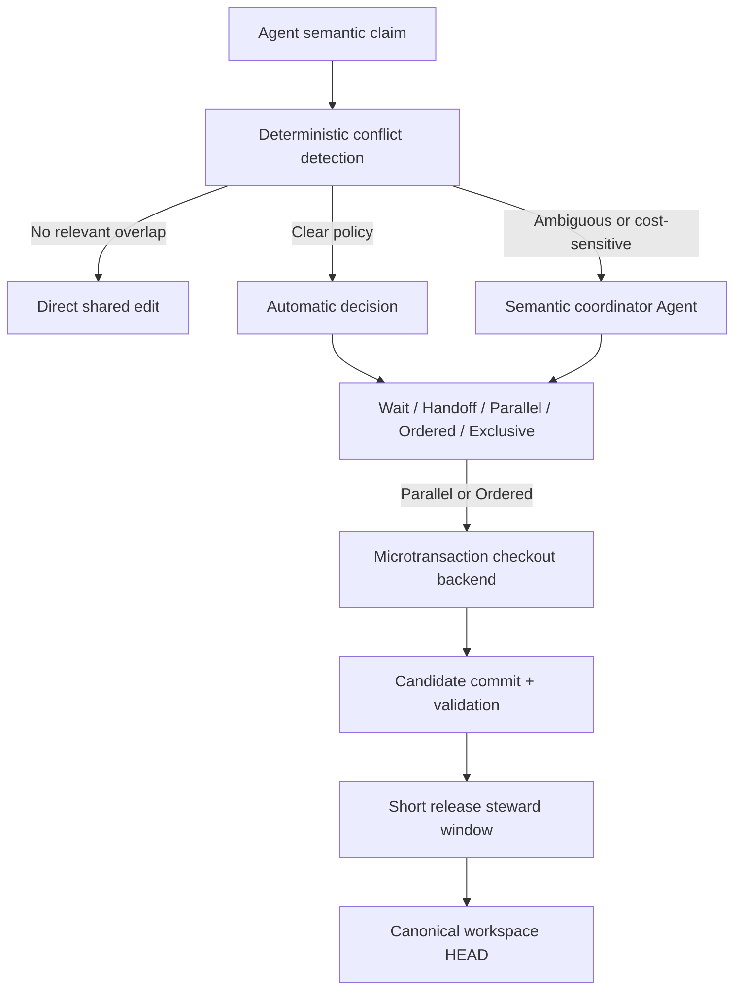
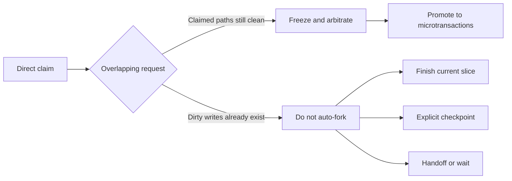
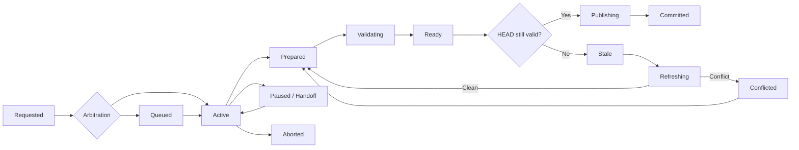

# Shared Workspace Semantic Microtransactions

- 状态：设计草案，待实现
- 日期：2026-08-05
- 暂定中文名：争用触发的语义微事务
- 暂定英文名：Contention-Triggered Semantic Microtransactions

## 目录

1. [摘要](#1-摘要)
2. [背景与问题](#2-背景与问题)
3. [目标与非目标](#3-目标与非目标)
4. [规范用语](#4-规范用语)
5. [核心原则与不变量](#5-核心原则与不变量)
6. [术语](#6-术语)
7. [系统架构](#7-系统架构)
8. [Semantic claim](#8-semantic-claim)
9. [仲裁模型](#9-仲裁模型)
10. [Direct claim 升级](#10-direct-claim-升级)
11. [Transaction 状态机](#11-transaction-状态机)
12. [GitWorktreeBackend](#12-gitworktreebackend)
13. [Validation 与过期判断](#13-validation-与过期判断)
14. [共享 workspace 发布谓词](#14-共享-workspace-发布谓词)
15. [共享脏工作树的并发语义](#15-共享脏工作树的并发语义)
16. [控制平面存储](#16-控制平面存储)
17. [崩溃恢复](#17-崩溃恢复)
18. [Handoff 与连续性](#18-handoff-与连续性)
19. [可观测性与争用热点](#19-可观测性与争用热点)
20. [性能演进](#20-性能演进)
21. [安全边界](#21-安全边界)
22. [概念接口](#22-概念接口)
23. [典型流程](#23-典型流程)
24. [第一版实施范围](#24-第一版实施范围)
25. [验收场景](#25-验收场景)
26. [已确定的设计决策](#26-已确定的设计决策)
27. [实现阶段可调参数](#27-实现阶段可调参数)

## 1. 摘要

本文定义一种面向多 Agent 共享代码仓库的并发协作模型。所有 Agent 默认在同一个
canonical workspace 中工作；只有当多个写入申请发生局部争用，且协调器判断并发收益高于
等待成本时，系统才为冲突范围创建短生命周期的 Git microtransaction。

microtransaction 绑定一次小型语义修改，不绑定 Agent 的完整任务。它从当前共享 `HEAD`
创建临时 branch 和 shadow checkout，在隔离位置完成修改、验证和必要的 rebase，随后由唯一
发布者以 fast-forward 方式推进共享 `HEAD`，并立即销毁临时资源。

该模型组合以下能力：

- Git commit 提供不可变版本快照；
- linked worktree 提供当前可用的临时物理隔离；
- semantic claim 描述物理写集、语义写集和失效依赖；
- 中心协调 Agent 负责不确定情形下的语义与成本仲裁；
- 确定性协调器负责状态转换、范围检查、Git 操作和恢复；
- 共享 index/HEAD 只在最终发布窗口内短暂串行化；
- 高频争用被视为架构或任务拆分问题，而不是自动合并能力不足。

第一版不修改 Git，不引入虚拟文件系统，也不给每个 Agent 创建长期 workspace。checkout
后端保持可替换，以便未来迁移到 sparse checkout、独立 index、overlay 或 VFS。

## 2. 背景与问题

现有共享工作区协调主要采用路径 claim、等待、handoff 和短时 Git steward。它能避免两个
Agent 无意覆盖对方的修改，但对路径重叠倾向于悲观串行化。

路径重叠不等于语义冲突。例如，两个 Agent 可能分别向同一个路由表文件添加 `/health`
和 `/metrics`，或者分别修改同一文件中的不同函数。这些工作具有相同物理写路径，但语义
写集不同，可以并行开发并依次快速发布。

传统人类开发通常使用按开发者或 feature 划分的长寿命分支。分支持续时间越长，与主线的
语义和文本漂移越大，最终合并成本越高。Agent 工作应被拆成更小、更独立的语义切片，因此
更适合使用按争用窗口创建、完成即销毁的临时分支。

本设计要解决的不是“自动合并所有冲突”，而是：

1. 无争用时保持共享编辑的低开销；
2. 偶发局部争用时允许安全、短时的并行开发；
3. 把可能冲突的 refresh/rebase 限制在 shadow checkout；
4. 让共享 workspace 始终保持可继续工作的状态；
5. 用争用数据识别不健康的代码边界和任务拆分。

## 3. 目标与非目标

### 3.1 目标

- 保留单一共享 canonical workspace 和 canonical branch；
- 默认使用 direct claim，不为无冲突工作创建 branch 或 checkout；
- 在 claim 冲突时先仲裁，再决定等待、handoff、并行、排序或独占；
- 将临时 branch 的生命周期限制为一次小型语义修改；
- 支持同文件、不同语义单元的并发开发；
- 支持可以并行开发但必须按序发布的 speculative work；
- 支持重构、移动、删除、公共契约和生成物的严格独占；
- 允许共享 workspace 存在不相关的 unstaged dirty files；
- 确保冲突解决不会污染共享 index 或工作树；
- 绑定 validation evidence、candidate commit 和 canonical base；
- 支持 owner handoff、崩溃恢复和非破坏性清理；
- 暴露持续争用热点并触发结构审查；
- 让无冲突 fast path 接近现有 claim 成本。

### 3.2 非目标

第一版明确不提供：

- 每个 Agent 一个永久 workspace；
- 长寿命 feature branch 管理；
- 任意 Git 冲突的自动语义解决；
- 操作系统级强制文件写入隔离；
- 跨主机或跨仓库的分布式原子事务；
- 自动 takeover 失联 owner 的修改；
- 修改 Git 内核或实现虚拟文件系统；
- 把所有读取过的文件记录为完整数据库式 read set；
- 通过更多自动合并掩盖持续的架构争用。

## 4. 规范用语

本文中的“必须”表示正确性或安全性要求；“应该”表示默认策略，只有记录明确理由后才可
偏离；“可以”表示可选能力。

## 5. 核心原则与不变量

### 5.1 默认共享，按需隔离

无冲突工作必须继续在共享 workspace 中直接进行。transaction 是路径或语义争用的一种解决
结果，不是 Agent 开始工作时的默认容器。

### 5.2 事务绑定语义切片，不绑定 Agent

一个 Agent 可以在任务执行期间依次创建多个 microtransaction，也可以完全不创建。一个
microtransaction 应只覆盖一个可快速验证、可独立发布的 semantic delta。

### 5.3 并行开发与串行发布分离

多个 transaction 可以同时 active，但共享 canonical `HEAD` 的推进必须串行。允许并行不
意味着允许无序发布；ordered transaction 必须遵守依赖顺序。

### 5.4 发布单位是原子 commit

transaction 可以涉及一个或多个文件，但正式发布形态应该是一个原子语义 commit。不得通过
覆盖共享文件来“push 文件”，否则会丢失跨文件不变量和来源信息。

### 5.5 冲突只在 shadow checkout 中解决

可能失败的 rebase、patch replay 或冲突解决不得发生在共享 workspace。共享 workspace 只
接收已经能够从当前 `HEAD` fast-forward 的候选 commit。

### 5.6 过期不是 takeover 授权

时间戳、心跳缺失和 TTL 只提供诊断信息。未发布修改只有 owner、明确 handoff 或用户授权
才能转移或删除。

### 5.7 高频争用是设计信号

反复争用必须形成可见的 contention signal，用于模块边界、公共 facade、生成流程或 Agent
任务拆分审查。

## 6. 术语

**Canonical workspace**

所有 Agent 默认共享的仓库工作树。其当前分支和 `HEAD` 表示已发布公共上下文。

**Direct claim**

Agent 在 canonical workspace 直接修改某个语义范围的临时写入权限。

**Semantic claim**

包含任务、意图、物理写路径、语义写资源和失效依赖的工作申请。

**Microtransaction**

为一次局部争用创建的短生命周期修改容器。

**Shadow checkout**

microtransaction 使用的临时物理文件视图。第一版由 Git linked worktree 实现。

**Candidate commit**

经过范围检查、准备发布的 transaction commit。

**Sensitive resource**

如果在 transaction 执行期间发生变化，就可能使实现或验证失效的路径、契约或语义资源。

**Release steward**

在短发布窗口内唯一拥有共享 Git index、HEAD 和 canonical branch 修改权限的协调者。

**Contention hotspot**

重复出现重叠申请、等待、rebase、冲突或返工的路径或语义资源。

## 7. 系统架构



### 7.1 语义协调 Agent

负责：

- 判断任务是否真的独立；
- 比较等待成本与 checkout、refresh、验证和返工成本；
- 在信息不足时选择 wait、handoff、parallel、ordered 或 exclusive；
- 记录理由、影响范围和重新评估点；
- 对 semantic claim 进行补充或升级；
- 识别高争用背后的结构问题。

它不直接充当锁文件，不以模型上下文作为唯一权威状态，也不绕过确定性检查发布代码。

### 7.2 确定性协调器

负责：

- 原子写入 claim、transaction 和 event 记录；
- 标准化路径并检测物理重叠；
- 执行兼容矩阵中的明确决策；
- 管理状态转换、owner 和 publish dependency；
- 创建和回收 shadow checkout；
- 计算 actual diff；
- 验证 candidate、base 和 validation binding；
- 串行化共享 Git index/HEAD 发布；
- 执行恢复和一致性检查。

### 7.3 Git

负责 canonical 历史、immutable base、transaction branch、linked worktree、diff、rebase、
文本冲突检测和 fast-forward 发布。Git 不是语义冲突判断器；文本无冲突不代表契约、schema
或行为无冲突。

### 7.4 Checkout backend

上层协议只依赖以下逻辑接口：

```text
materialize(base, declared_scope) -> checkout_handle
inspect_diff(checkout_handle) -> actual_write_set
prepare(checkout_handle) -> candidate_commit
refresh(checkout_handle, new_base) -> refreshed_candidate | conflict
dispose(checkout_handle)
```

第一版实现为 `GitWorktreeBackend`。未来可以替换为 sparse worktree、warm worktree pool、
alternate Git index、structured patch capsule、overlay filesystem 或 VFS。transaction record
保存 opaque checkout handle，上层状态机不得依赖具体 worktree 命令。

## 8. Semantic claim

### 8.1 最小结构

```yaml
schema: 1
scope: route-health
owner: agent-a
task: Add the /health route
intent: additive
write_paths:
  - src/router.ts
  - tests/test_router.py
semantic_writes:
  - route:/health
sensitive_to:
  - contract:http-routing
  - symbol:src/router.ts#registerRoute
first_release: Health route and focused test pass
validation:
  - focused router tests
depends_on: []
```

### 8.2 必填字段

`scope` 是一次工作切片的稳定语义名称，不等于整个任务或单纯文件名。

`owner` 是当前责任方的唯一 id，友好名称与 id 分开。

`task` 用一句话描述预期行为变化。

`write_paths` 是预期写集的保守上界；除纯 `read` 外必须提供，且不得默认声明整个 workspace。

`first_release` 描述第一个可以独立验证并发布的具体边界。

`intent` 使用受限枚举：

- `read`
- `additive`
- `local-edit`
- `contract`
- `refactor`
- `move`
- `delete`
- `generated`

### 8.3 条件必填字段

当路径重叠且申请者希望并发时，必须提供 `semantic_writes`，例如：

```text
route:/health
symbol:parseConfiguration
config-key:features.new-ui
test-case:rejects-expired-token
schema-field:user.email
```

`sensitive_to` 不是所有读取过的文件，而是 transaction 正确性依赖的资源。如果这些资源
发生变化，transaction 必须重新审阅或验证。

### 8.4 可选字段

`validation` 描述预期验证责任。

`depends_on` 表示必须先发布的 scope 或 transaction。

`estimated_release` 可以提供 `immediate`、`short` 或 `long` 作为成本判断提示，但不是授权依据。

### 8.5 协调器生成字段

申请者不得自行指定 base revision、transaction id、branch、checkout path、concurrency mode、
publish order、blocker、arbitration reason、actual write set、candidate 或 validation binding。

### 8.6 范围扩张

实际修改超出声明范围时，transaction 必须暂停 prepare 并申请扩张。

- 新范围无冲突时，可以原子扩张；
- 新范围有冲突时，必须重新仲裁；
- expansion 不得在持有现有资源时进入无限等待；
- 如果不能立即扩张，owner 应缩小修改、完成当前 slice、checkpoint、handoff 或重启事务。

该规则避免两个 transaction 各自持有一部分资源并等待对方资源的 hold-and-wait 死锁。

## 9. 仲裁模型

### 9.1 冲突来源

物理冲突包括同文件、父子路径、重叠目录、rename/move 源和目标、delete 范围、生成源与产物、
submodule gitlink 和 canonical build output。

语义冲突包括同一 symbol、route、config key、schema field、API/schema writer 与消费者、
公共 contract、生成器与生成物、唯一键、注册顺序和共享 invariant。

### 9.2 仲裁结果

**direct**：无相关重叠，继续在 canonical workspace 编辑。

**wait**：当前 owner 即将到达 first release，等待成本低于 transaction 成本。

**handoff**：两项工作实质属于同一语义变化，由一个 owner 完成更经济。

**parallel-tx**：可以并行开发，原则上允许任意顺序发布。

**ordered-tx**：可以并行开发，但存在 `publish_after`，后发布者必须 refresh 和重新验证。

**exclusive**：重叠资源严格串行，无关路径仍然 direct。

### 9.3 默认兼容矩阵

| 当前工作 | 新申请 | 语义关系 | 默认结果 |
|---|---|---|---|
| `read` | 任意 | 只读快照 | 允许，不阻塞写入 |
| `additive` | `additive` | 不同单元 | `parallel-tx` |
| `additive` | `local-edit` | 不同单元 | `parallel-tx` |
| `local-edit` | `local-edit` | 不同单元 | `parallel-tx` |
| `additive/local-edit` | 同类 | 关系不确定 | 语义仲裁：`wait` 或 `ordered-tx` |
| 任意写入 | 任意写入 | 相同语义单元 | `wait` 或 `handoff` |
| `contract` | 相关消费者或写入 | 相关 | `exclusive` 或严格 `ordered-tx` |
| `refactor/move/delete` | 重叠范围 | 相关 | `exclusive` |
| `generated` | 生成源或产物 | 相关 | `exclusive` |
| 已存在脏写入 | 后到重叠申请 | 任意 | 当前 owner 优先快速完成或 checkpoint |

相同语义单元不应默认 speculative。两个 Agent 同时重写同一函数通常只会制造重复推理和返工。

### 9.4 成本决策

```text
expected_wait_cost
    >
checkout_cost
+ refresh_cost
+ revalidation_cost
+ conflict_probability * rework_cost
```

第一版不要求精确数值。协调 Agent 根据 first release 距离、任务独立性、验证成本和历史争用
做定性判断，并记录理由。

### 9.5 自动与语义决策边界

- 无物理或语义重叠：自动 `direct`；
- 明确 exclusive intent：自动排队或独占；
- 路径重叠但 semantic units 明确不同：自动 `parallel-tx`；
- 已存在重叠脏写入：默认不动态 fork；
- 关系不确定或涉及成本权衡：请求语义协调 Agent；
- 任何降低 exclusive 要求的决定都必须记录理由。

### 9.6 公平性与无死锁要求

- 较早排队的 exclusive 请求阻止新的重叠 optimistic 请求无限插队；
- 无关资源不受 exclusive queue 影响；
- `publish_after` 必须构成无环图；
- 全部初始资源一次性原子授予；
- 资源 expansion 不能进入 hold-and-wait；
- TTL 只触发诊断，不触发自动 takeover 或删除。

## 10. Direct claim 升级

transaction 应尽量在重叠写入发生前创建。



升级前必须：

1. 通知现有 owner 停止对冲突范围继续写入；
2. 确认 action-required 消息已 acknowledgement；
3. 确认冲突范围在 canonical workspace 中仍然 clean；
4. 记录共同 base revision；
5. 将冲突范围从 direct 权限切换为 transaction 权限；
6. 只为获得 `parallel-tx` 或 `ordered-tx` 的请求创建 checkout。

如果现有 owner 已产生脏写入，默认让它快速完成 first release。捕获脏工作树为临时 Git tree
可以作为未来能力，但不属于第一版 fast path。

## 11. Transaction 状态机



- **Requested**：只有 claim 和语义意图，未创建资源。
- **Queued**：等待依赖或 owner；不得物化 checkout。
- **Materializing**：内部恢复状态，正在创建 branch 和 checkout。
- **Active**：owner 可以在 shadow checkout 修改声明范围；canonical 中相同范围被冻结。
- **Prepared**：candidate 存在，checkout clean，actual write set 未越界，候选是原子语义修改。
- **Validating**：验证绑定 candidate SHA、canonical base、validation plan、结果和已知限制。
- **Ready**：candidate、范围检查和 validation 均有效，可以申请发布。
- **Stale**：canonical `HEAD` 已前进，candidate 或 validation 不再直接适用。
- **Refreshing**：在 shadow checkout rebase/replay；clean 时回到 Prepared，冲突时进入 Conflicted。
- **Conflicted**：保留 checkout、base、candidate、冲突文件、validation 和 owner。
- **Paused/Handoff**：保存完整 checkpoint 并转移责任，不创建新 transaction。
- **Publishing**：内部两阶段状态，记录 `expected_head` 和 `candidate`。
- **Committed**：共享 `HEAD` 已到 candidate；清理失败只标记 `cleanup_pending`。
- **Aborted**：只有 owner、明确 handoff 决策或用户授权可以放弃未发布修改。

## 12. GitWorktreeBackend

### 12.1 Materialize

请求获得 `parallel-tx` 或 `ordered-tx` 后，协调器从激活时的 canonical `HEAD` 创建唯一临时
branch 和 linked worktree。queued 请求不提前选择 base 或物化资源。

branch 和 checkout 必须：

- 由 transaction id 唯一标识；
- 位于协调器管理并验证过的目录；
- 与 transaction record 双向关联；
- 不被用于其他 task；
- 不包含 canonical workspace 的未提交修改。

### 12.2 Edit 与 prepare

owner 对声明 write scope 的修改发生在 shadow checkout。prepare 必须：

1. 读取 branch 与 base；
2. 计算 tracked、untracked、rename 和 delete 的完整 actual diff；
3. 拒绝越界路径；
4. 拒绝未解决冲突和进行中的 Git 操作；
5. 将正式发布形态规范为一个原子 candidate commit；
6. 记录 candidate SHA 和 actual semantic summary；
7. 保持 checkout clean。

内部 checkpoint 可以存在，但不得把 Agent 的试错历史直接发布到 canonical branch。

### 12.3 Refresh

如果 canonical `HEAD` 前进，refresh 必须在 shadow checkout 中完成。共享 workspace 不参与
冲突解决。

### 12.4 Dispose

Committed transaction 可以自动删除已合并 branch 和 clean checkout。未发布、dirty、conflicted
或 owner 不明的资源不得自动强制删除。

清理前必须验证目标位于协调器管理目录、record 匹配、branch 已发布或存在显式 discard 授权，
且目标不是 workspace root、用户目录或模糊路径。

## 13. Validation 与过期判断

一次有效 validation 绑定：

```text
(candidate commit, canonical base, validation plan, result)
```

只记录“tests passed”不足以证明结果属于当前 candidate。

如果 `HEAD` 未变化，candidate 可以直接进入发布谓词检查。如果 `HEAD` 已变化，协调器计算
`base..HEAD` 的 intervening changes，并与 actual write set、`semantic_writes` 和
`sensitive_to` 比较。

明确无关时，可以在 shadow checkout refresh，记录 validation carry-forward 来源和理由，运行
风险相称的最小 smoke gate，并把 evidence 重新绑定到新 candidate。

触碰 `sensitive_to` 时，旧 validation 失效，必须重新审阅和验证。ordered transaction 默认在
前置 transaction 发布后重新验证。contract、schema、refactor、move、delete 或 generated
transaction 默认完整重新验证，不自动 carry forward evidence。

## 14. 共享 workspace 发布谓词

发布是硬安全边界，必须由确定性协调器执行。

### 14.1 Transaction 条件

- 状态是 Ready；
- owner 或授权 release steward 发起；
- candidate 存在；
- shadow checkout clean；
- actual write set 未越界；
- validation 绑定当前 candidate 和允许的 base；
- `publish_after` 依赖全部 Committed；
- action-required message 已处理；
- 没有 unresolved conflict。

### 14.2 Git 临界区条件

release steward 短暂取得：

```text
git-index
git-head
canonical-branch
```

随后确认：

- canonical workspace 没有 merge、rebase、cherry-pick、revert 或 bisect 正在进行；
- Git index 为空；
- 当前分支是预期 canonical branch；
- `HEAD == expected_head`；
- candidate 能从当前 `HEAD` fast-forward；
- `HEAD..candidate` 只包含当前 transaction 获准发布的 commit，通常恰好一个；
- candidate 的祖先可以包含已经进入当前 canonical `HEAD` 的其他 transaction，但不能夹带
  当前 `HEAD` 之外的未知 commit。

第一版要求 index 完全为空。即使 staged paths 不重叠，推进 `HEAD` 也会改变 staged diff 基准，
容易导致其他 Agent 后续误提交。

### 14.3 Dirty path 条件

发布器计算：

```text
transaction_actual_paths
shared_dirty_paths
other_active_direct_claim_paths
```

必须满足：

```text
transaction_actual_paths ∩ shared_dirty_paths = ∅
transaction_actual_paths ∩ other_active_direct_claim_paths = ∅
```

重叠判断包括同文件、父子路径、rename 源和目标、delete 范围中的脏子路径、candidate 新建路径
与 untracked 文件，以及 submodule gitlink 与本地 submodule 状态。不相关的 unstaged dirty
files 可以保留，不要求整个 workspace clean。

### 14.4 Semantic 条件

- validation 后没有未处理的相关 semantic event；
- exclusive resource 没有其他 owner；
- publish order 没有被新 dependency 改写；
- arbitration decision 仍适用于当前 scope。

### 14.5 发布动作与后置检查

所有条件成立后才能 fast-forward。不得在 canonical workspace 中尝试冲突解决、cherry-pick 后
人工修复、stash 他人修改、broad stage、reset、clean 或覆盖 untracked 文件。

发布后必须确认：

- `HEAD == candidate`；
- transaction paths 与 candidate diff 一致；
- 发布前的不相关 dirty paths 仍被保留；
- transaction 已记录 Committed；
- Git 资源已释放；
- dependent queued requests 可以重新调度。

## 15. 共享脏工作树的并发语义

canonical workspace 可以同时包含多个 Agent 的不相关 unstaged changes。transaction branch 从
已提交 `HEAD` 创建，不包含这些未提交修改。

这只有在以下条件下安全：

- transaction write set 与 dirty paths 不重叠；
- transaction correctness 不依赖 dirty 内容；
- 如果存在依赖，资源已声明在 `sensitive_to`，协调器必须等待 checkpoint 或发布；
- fast-forward 不覆盖 dirty paths；
- 共享 index 保持为空并由 release steward 独占。

Agent 修改无关文件期间 `HEAD` 被推进后，其 unstaged changes 会自然变为相对于新 `HEAD` 的
修改。这是单一共享 workspace 的预期行为，但只在路径和语义边界独立时成立。

## 16. 控制平面存储

### 16.1 第一版选择

第一版不要求 SQLite 或长驻 daemon。继续使用本地、可读、可恢复的协调目录，并增加不可变
event 和 materialized transaction snapshot。

```text
.agent-coordination/
├── claims/
├── transactions/
│   ├── active/
│   └── archive/
├── events/
├── checkouts/
├── waiting/
├── handoffs/
├── messages/
├── acks/
├── archive/
├── metrics/
└── locks/
```

该目录默认保持本地并加入 ignore；除非用户明确要求，不进入产品提交历史。

### 16.2 权威来源

- canonical Git `HEAD`：已发布代码内容；
- transaction branch/candidate：未发布代码内容；
- immutable event log：协调状态转换；
- materialized JSON snapshot：可由 event 重建的快速查询视图；
- messages/acks/handoffs：授权、协商与连续性证据。

协调状态转换使用短时 advisory lock、exclusive create 和 atomic replace。锁只保护状态转换，
不覆盖 Agent 编辑、长时间测试或等待。

### 16.3 Git 与 event 的一致性

Git 操作与 JSON event 无法成为同一文件系统原子事务，因此使用可恢复的两阶段记录：

```text
publish-started(expected_head, candidate)
    → Git fast-forward
    → publish-completed(candidate)
```

materialize 和 cleanup 使用相同的 intent/completion 模式。

## 17. 崩溃恢复

### 17.1 Materializing 中断

- branch 和 checkout 都不存在：回到 Queued 或重试；
- branch 存在、checkout 不存在：验证 branch 后重新 materialize；
- checkout 存在且 record 匹配：补记 Active；
- 资源 owner 无法确认：保留并请求人工或用户判断。

### 17.2 Publishing 中断

给定 `expected_head = H`、`candidate = C`：

- 当前 `HEAD == C`：补记 Committed；
- 当前 `HEAD == H`：发布尚未发生，可以安全重试；
- 当前 `HEAD` 为其他 revision：标记 Stale，重新 refresh；
- canonical workspace 处于异常 Git 状态：停止自动操作并报告。

### 17.3 Cleanup、owner 与 orphan

Committed 是不可逆的业务结果。清理失败只标记 `cleanup_pending`，不得重复发布。owner 失联时
保留 checkout、candidate 和 checkpoint，只发送 takeover request。无法匹配 transaction record
的 worktree 或 branch 只报告，不自动删除。

## 18. Handoff 与连续性

handoff 必须保存 objective、original claim、arbitration decision、base、declared/actual write
sets、semantic writes、sensitive resources、checkout handle、candidate、validation、known
failure、remaining work 和 next safe action。

handoff 转移的是 transaction capability 和责任，不复制或重建 branch。需要 acknowledgement 的
handoff 在接收方确认前不能改变写入权限。

## 19. 可观测性与争用热点

协调器应该记录：

- 路径和 semantic resource 的 overlap 次数；
- wait、handoff、parallel、ordered 和 exclusive 次数；
- 请求到发布的持续时间；
- checkout materialization 时间；
- refresh/rebase 次数；
- 文本冲突和语义重新验证次数；
- aborted、discarded 和 cleanup_pending 次数；
- estimated wait 与实际 transaction 成本；
- actual diff 越界导致的重新仲裁次数。

持续热点应产生结构化报告：

```yaml
hotspot: src/router.ts
window: recent-20-transactions
overlapping_requests: 7
ordered_transactions: 4
rebase_conflicts: 3
scope_expansions: 2
possible_causes:
  - unrelated responsibilities share one module
  - public registration facade is a write bottleneck
  - task slices are too coarse
recommended_review:
  - semantic owner boundary
  - registry or plugin structure
  - task decomposition policy
```

阈值只触发提示，不自动执行重构、takeover 或 destructive action。

## 20. 性能演进

### 20.1 Fast path

- 无冲突 claim 不创建 transaction；
- 明确兼容检查无需调用语义 Agent；
- queued 请求不创建 checkout；
- publish lock 不包含测试；
- transaction 完成后立即释放资源。

### 20.2 Checkout 优化顺序

1. 普通 linked worktree，优先正确性和可调试性；
2. 测量 checkout、测试和协调耗时；
3. 对小范围修改引入 sparse checkout；
4. 对高频短事务引入带 owner sentinel 的 warm checkout pool；
5. 对无需完整构建的编辑引入 alternate index 或 patch capsule；
6. 最终评估 overlay/VFS 或 Git 扩展。

warm pool 的 reset/clean 只能作用于协调器专属、经过 sentinel 验证的 scratch worktree，绝不能
作用于 canonical workspace 或路径不明的目录。

## 21. 安全边界

- 不清理、回滚、格式化、stage 或 commit 其他 owner 的工作；
- 不使用 worktree-wide stash；
- 不在共享 workspace broad stage；
- 不允许路径逃逸 workspace 或 scratch root；
- 不用模糊 glob、用户目录、workspace root 或未解析变量作为清理目标；
- 不自动删除 dirty、conflicted 或 owner 不明的 checkout；
- 不允许中心 Agent 绕过 deterministic publish predicate；
- 不把 semantic declaration 当作 Git 范围检查的替代品；
- 不把文本无冲突当作语义安全证明；
- 不允许 transaction 因追求吞吐量而无限增长。

本协议是协作式权限模型，不是内核强制隔离。Agent 或外部进程绕过协调器直接写文件仍可能
破坏不变量；协调器应检测异常状态并安全停止。

## 22. 概念接口

命令名称可以在实现阶段调整，但能力边界应保持如下：

```text
claim request        提交语义 claim
claim update         在写入前缩小或扩大意图
claim status         查看 direct、waiting 和冲突关系
arbitrate            记录 wait/handoff/parallel/ordered/exclusive 决策

tx activate          为已授权请求物化 shadow checkout
tx status            查看 base、owner、状态、路径和 blocker
tx prepare           生成并检查 candidate commit
tx validate          绑定 validation evidence
tx refresh           在 shadow checkout 更新到最新 HEAD
tx publish           检查发布谓词并 fast-forward canonical HEAD
tx pause             保存 checkpoint
tx handoff           转移责任与 capability
tx abort             显式放弃但默认保留可恢复证据
tx cleanup           清理已发布或明确 discard 的资源

coord reconcile      根据 Git 和 event 恢复中断状态
coord hotspots       输出争用统计和结构审查建议
```

状态查询应该同时支持紧凑人类输出和稳定 JSON 输出，便于 Agent 低 token 成本地读取。

## 23. 典型流程

### 23.1 无冲突 direct flow

Agent 申请路径；无相关冲突；协调器授予 direct；Agent 在 canonical workspace 编辑并按现有
release steward 流程发布。全程不创建 transaction。

### 23.2 同文件、不同语义单元

A 申请 `src/router.ts` 的 `route:/health`，B 申请同文件的 `route:/metrics`。两者尚未写入，
协调器决定 `parallel-tx`。A、B 从共同 `H0` 创建短命 transaction。A 发布为 `H1`；B 在 shadow
checkout refresh 到 `H1`，完成相称验证后发布为 `H2`；随后清理两者资源。

### 23.3 可并行开发但必须排序

A 调整注册结构，B 添加注册项。协调器允许同时开发，但记录 `B publish_after A`。A 发布后，
B 基于新结构 refresh 并重新验证，然后发布。

### 23.4 已有脏修改后出现重叠

A direct claim 已修改目标文件，B 后到申请同一路径。协调器不自动捕获或 fork A 的脏状态；
A 优先完成 first release，或显式 checkpoint/handoff；B 从新 canonical HEAD 开始。

### 23.5 重构独占

A 申请 refactor 并覆盖相关 contract。协调器授予 scoped exclusive，重叠申请排队，其他模块
保持 direct。完成后唤醒队列；如果该路径频繁 exclusive，生成 hotspot。

## 24. 第一版实施范围

第一版应包含：

- 扩展现有 shared-workspace semantic claim；
- 确定性物理冲突检测和基础兼容矩阵；
- 语义 Agent 仲裁记录；
- transaction 状态机和 event/snapshot 存储；
- Git linked worktree backend；
- actual diff 范围检查；
- candidate、validation 和 base binding；
- shadow checkout 内 refresh/rebase；
- 共享 dirty workspace 下的严格 fast-forward publish；
- handoff、abort、cleanup 和 reconcile；
- 基础 contention metrics 和 hotspot 输出。

第一版不包含 VFS、warm pool、AST-aware merge、structured patch replay、跨仓库事务或自动重构。

## 25. 验收场景

实现至少必须覆盖：

1. 无重叠 claim 走 direct，且不创建 checkout；
2. 同文件、不同 semantic units 创建 parallel transaction；
3. 两个 transaction 依次发布后，共享 `HEAD` 同时包含两者；
4. ordered transaction 在前置发布后 refresh 并重新验证；
5. 同一 semantic unit 默认 wait 或 handoff；
6. refactor/move/delete/contract 对相关范围独占；
7. 已有脏写入时不自动 fork；
8. unrelated unstaged dirty file 不阻止 transaction 发布；
9. overlapping dirty 或 untracked path 阻止发布；
10. 非空 shared index 阻止发布；
11. rebase 冲突只出现在 shadow checkout；
12. actual diff 越界阻止 prepare；
13. HEAD 在 validation 后前进会触发 stale/carry-forward 判断；
14. publish 中断后能由 expected HEAD 和 candidate 恢复；
15. committed 但 cleanup 失败不会重复发布；
16. stale claim 不会自动 takeover；
17. dirty/conflicted checkout 不会被自动删除；
18. 较早 exclusive 请求不会被新的重叠 optimistic 请求无限插队；
19. publish dependency 图拒绝环；
20. 重复争用能够形成 hotspot 报告。

## 26. 已确定的设计决策

- canonical context 是当前共享 workspace 的当前分支和 `HEAD`；
- 不为每个 Agent 创建长期 workspace；
- temporary checkout 可以存在，但只属于 microtransaction；
- transaction 由 claim 冲突和仲裁触发，不由 Agent 默认创建；
- 仲裁先于 checkout；
- 无冲突工作继续 direct；
- branch 生命周期绑定一次小型语义修改；
- transaction 完成后立即发布和清理；
- queued 请求不物化 checkout；
- 已存在脏写入后默认不动态 fork；
- 并行开发与串行发布分离；
- candidate 在 shadow checkout 中 refresh 和解决冲突；
- shared workspace 只接受 fast-forward candidate；
- unrelated unstaged dirty files 可以与发布共存；
- shared index 在发布时必须为空；
- checkout backend 可替换，第一版使用 Git linked worktree；
- 第一版使用本地可读 event/snapshot，不要求数据库或 daemon；
- 高频争用触发结构审查，而不是无限增强自动合并。

## 27. 实现阶段可调参数

以下内容不改变协议，可以在原型测试后调整：

- transaction id 和 branch 命名；
- event 文件名和 snapshot schema；
- semantic resource key 的规范化语法；
- `immediate/short/long` 的提示定义；
- hotspot 的统计窗口和阈值；
- validation carry-forward 所需的最小 smoke gate；
- checkout 放置位置；
- sparse checkout 的启用条件；
- 人类输出和 JSON 输出的命令名称。

这些参数必须通过兼容 schema 或迁移机制演进，不能削弱所有权、发布和恢复不变量。
