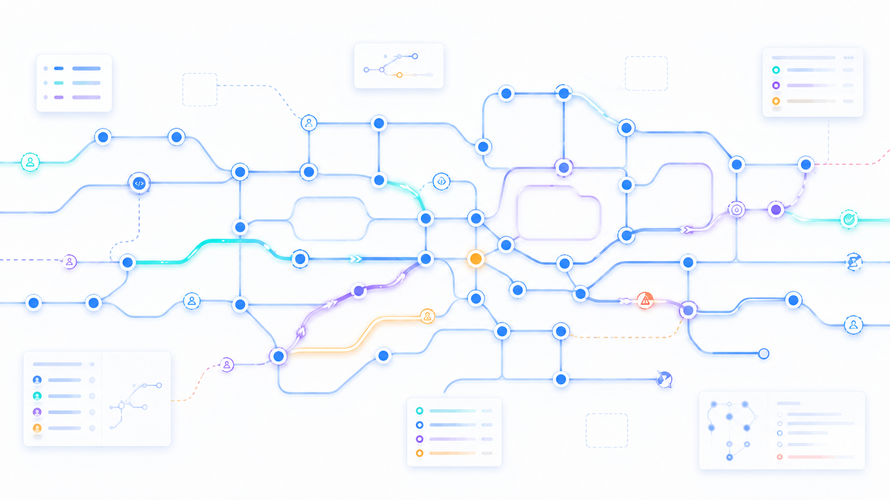
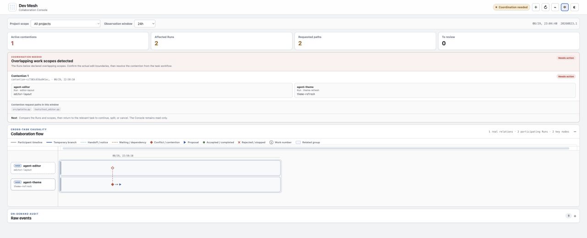

<p align="right"><a href="README.md">中文</a> · <strong>English</strong></p>

# Dev Mesh

Dev Mesh coordinates multiple Agents working in one Git workspace. Before writing, an Agent records
its task and intended scope. When scopes overlap, Dev Mesh coordinates waiting, handoff, or isolated
work. Commits run serially through managed Git operations. State remains under
`.dev-mesh/` in the workspace and does not depend on a remote service.



The plugin provides two skills:

- [`coordinate-shared-workspace`](skills/coordinate-shared-workspace/SKILL.md) — manages Runs,
  Claims, contention, and Git commits.
- [`observe-dev-mesh`](skills/observe-dev-mesh/SKILL.md) — collects workspace state read-only and
  serves the local Console.

## Install

Dev Mesh is published through the [Glenzli Marketplace](https://github.com/glenzli/marketplace):

```bash
codex plugin marketplace add glenzli/marketplace --ref main
codex plugin add dev-mesh@glenzli-marketplace
```

The marketplace needs to be registered only once. Use a new task after installing or updating the
plugin.

## Working model

- **Run** — one Agent task in the current workspace.
- **Claim** — the paths and semantic scope that Run intends to modify.
- **Work Result** — records completion and releases the Claim when work produced changes.
- **Contention** — overlapping Claims from different Runs that must wait or be handled explicitly.

The routine path is:

```text
inspect -> join Run -> create or reuse Claim -> edit -> validate
        -> finish the Claim or commit through it -> leave Run
```

Without cross-Run overlap, the path uses one Run and one Claim. When overlap occurs, the later Claim
can wait. Handoff, exclusivity, or a short-lived branch is used only when needed. See
[`coordinate-shared-workspace`](skills/coordinate-shared-workspace/SKILL.md) for commands and
recovery procedures.

Dev Mesh can record communication that has already happened, but it does not send messages or wake
tasks. Contacting another task still uses the host environment's task controls.

## Console

The Observer collects workspace state into an external SQLite catalog and serves a loopback-only Web
Console:

```bash
python3 skills/observe-dev-mesh/scripts/console.py \
  --db /absolute/path/observer.sqlite3 \
  --root /absolute/project-parent \
  --host 127.0.0.1 --port 8765
```

The Console shows current Runs, Claims, contention, handoffs, recovery state, and cross-project
relations. Active contention presents the participating Runs, declared scopes, and requested
paths directly. Collaboration history opens by default and includes recorded notifications,
handoffs, dependencies, contention, and recovery, whether or not a conflict is currently active.
Cross-project relations retain their latest recorded time and closure state; within-project lanes
keep participant identities separate by project. Select a project and a window from 6 hours to
30 days. Node spacing does not measure duration; missing activity is not reconstructed, and truncated
results are marked. Raw events can be expanded to check evidence. The view reuses existing records
without adding Agent reporting steps. The Observer does not write to collected workspaces.

The example below uses virtual data to show the contention workbench and collaboration flow. It is
not a production activity capture.



On macOS, the repository-owned LaunchAgent can keep the Console running:

```bash
python3 scripts/install_console_service.py install
python3 scripts/install_console_service.py status
```

## Protocol and state

- The current write contract is `dev-mesh.coordination@20260823.1`.
- The optional cross-project relation contract is
  `dev-mesh.cross-project-collaboration@20260823.1`.
- Current state under `.dev-mesh/coord/20260823.1/` is authoritative. Events, the Observer, and
  the Console are diagnostic surfaces.
- The Observer can read `20260814.1` and `20260823.1` sources. Unknown versions are reported as
  compatibility problems.
- Old authority state is not migrated during cutover. See [`docs/CUTOVER.md`](docs/CUTOVER.md).

See [`DESIGN.md`](DESIGN.md), [`contracts/`](contracts/), and [`schemas/`](schemas/) for protocol
guarantees and state layout.

## Development and release

Maintainers build the plugin from a clean source commit, then synchronize it to a marketplace
working tree:

```bash
python3 scripts/plugin_dist.py build
python3 scripts/plugin_dist.py sync \
  --package dist/dev-mesh --marketplace-root ../marketplace --replace
```

`sync` does not commit or push either repository. Release versions use plain `MAJOR.MINOR.PATCH`;
the source commit is recorded separately as `source_revision` in the release metadata.

The package contains the manifest, runtime, skills, assets, current schemas, and contracts. Tests,
historical state, and caches are excluded. The packaged icon is
[`assets/dev-mesh.png`](assets/dev-mesh.png); its source artwork remains at
[`docs/assets/dev-mesh-icon-original.png`](docs/assets/dev-mesh-icon-original.png).

## Repository map

- [`runtime/dev_mesh_coord/`](runtime/dev_mesh_coord/) — coordination state and commands.
- [`runtime/dev_mesh_observer/`](runtime/dev_mesh_observer/) — read-only collection and catalog.
- [`runtime/dev_mesh_console/`](runtime/dev_mesh_console/) — local API and Web Console.
- [`runtime/tests/`](runtime/tests/) — protocol, concurrency, recovery, Observer, and Console tests.
- [`skills/`](skills/) — Agent entry points and operating instructions.
- [`contracts/`](contracts/) and [`schemas/`](schemas/) — public protocols and data structures.

## Validation

Run the full gate for protocol or cross-boundary changes:

```bash
PYTHONPATH=runtime python3 -m unittest discover -s runtime/tests -v
PYTHONPATH=runtime python3 -m compileall -q \
  runtime/dev_mesh_coord runtime/dev_mesh_observer runtime/dev_mesh_console runtime/tests
python3 skills/coordinate-shared-workspace/scripts/coord.py --help
python3 skills/observe-dev-mesh/scripts/console.py --help
```

Documentation and presentation changes need only the checks relevant to the changed surface.
