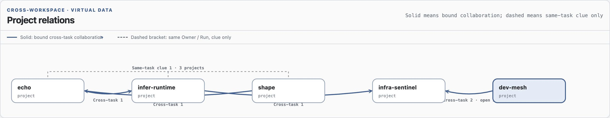
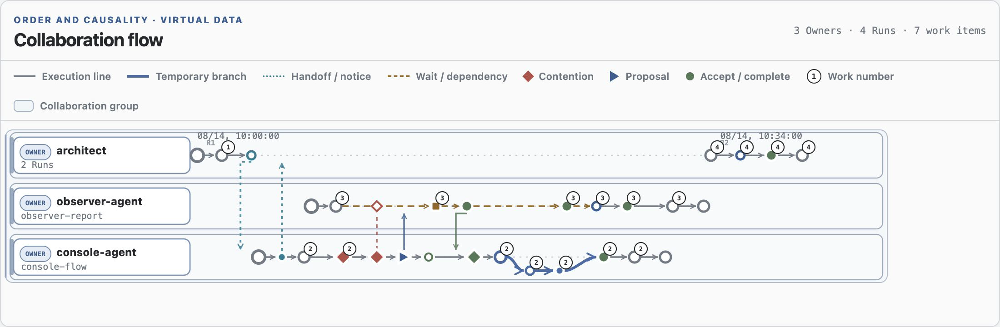

<p align="right"><a href="README.md">中文</a> · <strong>English</strong></p>

# Dev Mesh

Dev Mesh is the current-generation coordination layer for multiple Agents working in one shared
Git workspace. It gives short-lived work explicit authority, makes overlap resolvable, serializes
cooperative Git publication, and leaves bounded evidence that can be inspected after the work is
over.

The system is deliberately local and lightweight: an ordinary non-overlapping change follows one
Run, one Claim, one managed commit, and a clean exit. Contention, temporary branches, and
microtransactions appear only when the work actually overlaps.

## Current generation

The active authority contract is `dev-mesh.coordination@20260812.1`. This is the second-generation
implementation, but protocol versions use immutable `YYYYMMDD.x` identifiers rather than a mutable
`v2` label. The optional compatible cross-project evidence contract is
`dev-mesh.cross-project-collaboration@20260813.1`.

Workspace authority lives under `.dev-mesh/`. Retired `.agent-coordination/` state is not migrated
or revived; the cutover leaves only a tombstone that fences old writers. See
[`docs/CUTOVER.md`](docs/CUTOVER.md) for the retirement procedure.

## What it coordinates

- **Run** — one Agent task in one Git workspace.
- **Claim** — the exact paths and semantic resources that Run may change.
- **Contention** — a bounded decision when Claims overlap: wait, reassign, hand off, or use a
  temporary transaction branch.
- **Managed Git publication** — direct commits and transaction publication share one canonical Git
  fence, so cooperating Agents do not race the workspace index or branch.
- **Events** — low-frequency immutable lifecycle evidence. Heartbeats update snapshots without
  producing event traffic.
- **Observer and Console** — read-only projections, diagnostics, collaboration flows, and
  cross-project evidence. They never grant or reconstruct authority.

Dev Mesh records communication; it does not deliver it. An Agent must first contact, create, or
resume the real target task using the host's task controls, then record that successful action with
Dev Mesh. `send`, `ack`, and handoff commands never start or wake another task by themselves.

## Routine Agent path

The globally linked [`coordinate-shared-workspace`](skills/coordinate-shared-workspace/SKILL.md)
skill owns the operational instructions. Its normal path is:

```text
inspect -> join Run -> claim bounded work -> edit -> validate
        -> managed direct commit -> release Claim -> leave Run
```

No overlap means no coordinator ceremony beyond that path. When the returned `next_action` reports
overlap or recovery, the skill routes the Agent to the corresponding contention, transaction, or
recovery instructions.

## See the coordination model

These Console examples use virtual data rendered by the real project-relation and collaboration-
flow components. They illustrate the visual grammar; they are not captured production activity.

The project view separates explicit, receiver-bound cross-task collaboration from weaker same-Run
evidence. A solid arrow is a recorded collaboration relation. A dashed bracket means only that one
Owner/Run identity appeared in several workspaces; it is a clue, not proof that tasks communicated.



The swimlane view groups Runs by Owner and places lifecycle events on execution lanes. It makes
notifications, contention decisions, waiting, temporary transaction branches, publication, and
return to the canonical line visible without opening every event record.



## Observe locally

The independent [`observe-dev-mesh`](skills/observe-dev-mesh/SKILL.md) skill collects current
control planes into an external SQLite catalog and serves the loopback-only Web Console:

```bash
python3 skills/observe-dev-mesh/scripts/console.py \
  --db /absolute/path/observer.sqlite3 \
  --root /absolute/project-parent \
  --host 127.0.0.1 --port 8765
```

The Console shows project-filtered authority, contention, transactions, diagnostics, semantic
collaboration flows, and cross-project relations. Catalog data stays outside observed workspaces;
the source workspaces remain read-only to the Observer.

On macOS, install the repository-owned LaunchAgent to keep the Console available after moving the
checkout or changing its Python runtime:

```bash
python3 scripts/install_console_service.py install
python3 scripts/install_console_service.py status
```

By default the service also publishes the redacted
`dev-mesh.observer.status@20260812.1` Unix-socket offer through
`infra.discovery.registration@20260812.1`. Registration is discovery evidence, not proof of
liveness; consumers still connect to the current endpoint.

## Repository map

- [`runtime/dev_mesh_coord/`](runtime/dev_mesh_coord/) — authority, contention, recoverable Git
  effects, managed commits, microtransactions, and cross-project relation production.
- [`runtime/dev_mesh_observer/`](runtime/dev_mesh_observer/) — bounded source validation, catalog,
  diagnostics, and reports.
- [`runtime/dev_mesh_console/`](runtime/dev_mesh_console/) — loopback API, collection lifecycle, and
  browser dashboard.
- [`runtime/tests/`](runtime/tests/) — protocol, crash-window, concurrency, Observer, Console, and
  cutover coverage.
- [`skills/`](skills/) — thin Agent-facing launchers and instructions; protocol logic remains in the
  runtime.
- [`contracts/`](contracts/) and [`schemas/`](schemas/) — normative public surface.
- [`DESIGN.md`](DESIGN.md) — architecture boundaries, state layout, and deeper navigation.

## Validate

Run the complete gate for protocol or cross-boundary changes:

```bash
PYTHONPATH=runtime python3 -m unittest discover -s runtime/tests -v
PYTHONPATH=runtime python3 -m compileall -q \
  runtime/dev_mesh_coord runtime/dev_mesh_observer runtime/dev_mesh_console runtime/tests
python3 skills/coordinate-shared-workspace/scripts/coord.py --help
python3 skills/observe-dev-mesh/scripts/console.py --help
```

For bounded documentation or presentation changes, use the focused checks that prove the changed
links, commands, or rendered component before escalating to the full gate.
