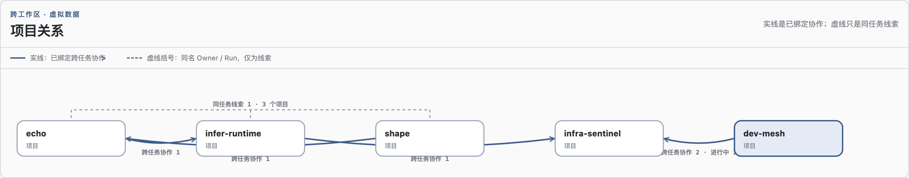
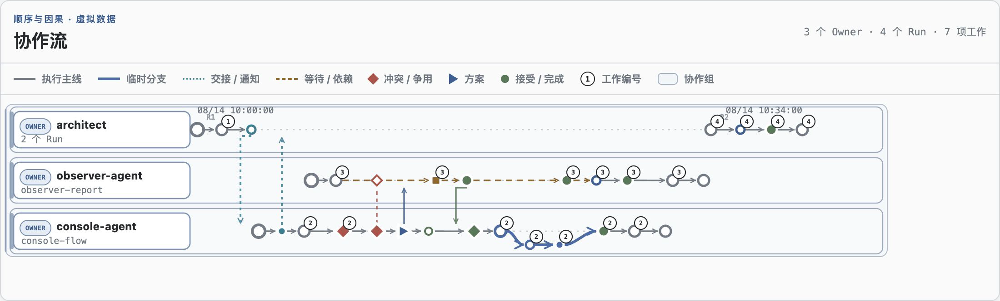

<p align="right"><strong>中文</strong> · <a href="README.en.md">English</a></p>

# Dev Mesh

Dev Mesh 是面向多个 Agent 共享同一个 Git 工作区的当前代协同层。它为短周期工作提供明确
权限，处理工作重叠，串行化协作式 Git 发布，并留下可在事后检查的有界证据。

系统有意保持本地化和轻量：普通的非重叠修改只经过一个 Run、一个 Claim、一次受管提交和
一次干净退出。只有实际发生重叠时，才会进入争用处理、临时分支和微事务。

## 当前代

当前启用的权限合同是 `dev-mesh.coordination@20260812.1`。这是第二代实现，但协议使用不可变
的 `YYYYMMDD.x` 标识，而不是持续变化的 `v2` 标签。可选且兼容的跨项目证据合同是
`dev-mesh.cross-project-collaboration@20260813.1`。

工作区权限位于 `.dev-mesh/`。已退役的 `.agent-coordination/` 状态不会迁移或恢复；切换后只
保留用于阻止旧写入方的 tombstone。退役流程见 [`docs/CUTOVER.md`](docs/CUTOVER.md)。

## 协调对象

- **Run** — 一个 Agent 任务在一个 Git 工作区中的执行身份。
- **Claim** — 该 Run 可以修改的精确路径和语义资源。
- **Contention** — Claim 重叠时的有界决策：等待、重分配、交接，或使用临时事务分支。
- **受管 Git 发布** — 直接提交和事务发布共享一个 canonical Git fence，避免协作 Agent 争用
  工作区 index 或分支。
- **Events** — 低频、不可变的生命周期证据；heartbeat 只更新快照，不产生事件流量。
- **Observer 和 Console** — 只读投影、诊断、协作流和跨项目证据；它们不授予或重建权限。

Dev Mesh 记录通信，但不负责投递。Agent 必须先通过宿主环境的任务控制能力联系、创建或恢复
真实目标任务，再用 Dev Mesh 记录已经成功执行的动作。`send`、`ack` 和 handoff 命令本身不会
启动或唤醒另一个任务。

## Agent 常规路径

全局链接的 [`coordinate-shared-workspace`](skills/coordinate-shared-workspace/SKILL.md) 技能
提供操作说明。普通路径是：

```text
检查 -> 加入 Run -> Claim 有界工作 -> 编辑 -> 验证
     -> 受管直接提交 -> 释放 Claim -> 离开 Run
```

没有重叠时，不会引入额外协调流程。返回的 `next_action` 发现重叠或恢复需求时，技能才会把
Agent 路由到对应的争用、事务或恢复步骤。

## 协同模型一览

下面的 Console 示例由真实的项目关系和协作流组件使用虚拟数据渲染，用于说明视觉语义，
不是生产活动截图。

项目视图区分显式绑定且由接收方确认的跨任务协作，与较弱的同 Run 线索。实线箭头表示已记录
的协作关系；虚线括号只表示同一个 Owner/Run 身份出现在多个工作区中，它是线索，不是任务间
发生通信的证明。



泳道视图按 Owner 聚合 Run，并把生命周期事件放在执行线上。无需逐条打开事件，即可看到通知、
争用决策、等待、临时事务分支、发布以及回到 canonical 执行线的过程。



## 本地观测

独立的 [`observe-dev-mesh`](skills/observe-dev-mesh/SKILL.md) 技能把当前控制面采集到外部
SQLite catalog，并启动仅监听 loopback 的 Web Console：

```bash
python3 skills/observe-dev-mesh/scripts/console.py \
  --db /absolute/path/observer.sqlite3 \
  --root /absolute/project-parent \
  --host 127.0.0.1 --port 8765
```

Console 展示按项目过滤的权限、争用、事务、诊断、语义协作流和跨项目关系。Catalog 位于被
观测工作区之外；Observer 对源工作区保持只读。

在 macOS 上，移动仓库或更换 Python runtime 后，可安装仓库自带的 LaunchAgent，使 Console
持续运行：

```bash
python3 scripts/install_console_service.py install
python3 scripts/install_console_service.py status
```

服务默认还会通过 `infra.discovery.registration@20260812.1` 发布经过脱敏的
`dev-mesh.observer.status@20260812.1` Unix socket offer。Registration 是发现证据，不代表
服务仍然存活；消费者仍需连接当前 endpoint 进行确认。

## 仓库导航

- [`runtime/dev_mesh_coord/`](runtime/dev_mesh_coord/) — 权限、争用、可恢复 Git effect、受管
  提交、微事务和跨项目关系生产端。
- [`runtime/dev_mesh_observer/`](runtime/dev_mesh_observer/) — 有界源验证、catalog、诊断和报告。
- [`runtime/dev_mesh_console/`](runtime/dev_mesh_console/) — loopback API、采集生命周期和浏览器
  看板。
- [`runtime/tests/`](runtime/tests/) — 协议、崩溃窗口、并发、Observer、Console 和切换测试。
- [`skills/`](skills/) — 面向 Agent 的薄启动器和操作说明；协议逻辑仍由 runtime 持有。
- [`contracts/`](contracts/) 和 [`schemas/`](schemas/) — 规范性的公共协议表面。
- [`DESIGN.md`](DESIGN.md) — 架构边界、状态布局和深入导航。

## 验证

协议或跨边界修改使用完整验证门：

```bash
PYTHONPATH=runtime python3 -m unittest discover -s runtime/tests -v
PYTHONPATH=runtime python3 -m compileall -q \
  runtime/dev_mesh_coord runtime/dev_mesh_observer runtime/dev_mesh_console runtime/tests
python3 skills/coordinate-shared-workspace/scripts/coord.py --help
python3 skills/observe-dev-mesh/scripts/console.py --help
```

对于有界的文档或展示修改，先运行能够证明链接、命令或渲染组件正确的聚焦检查，再按风险决定
是否升级到完整验证门。
