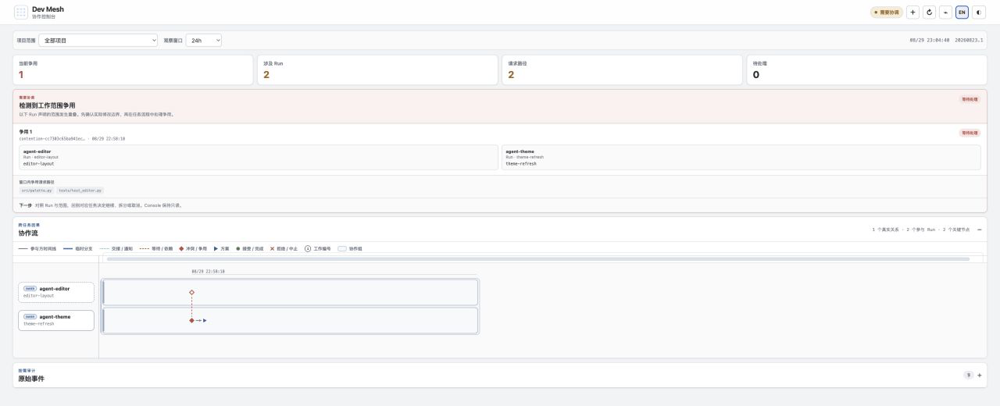

<p align="right"><strong>中文</strong> · <a href="README.en.md">English</a></p>

# Dev Mesh

Dev Mesh 用于多个 Agent 在同一个 Git 工作区内并行工作。Agent 在写入前登记任务和修改范围；
范围重叠时，Dev Mesh 协调等待、交接或隔离处理；提交通过受管 Git 操作串行执行。
状态保存在工作区的 `.dev-mesh/` 中，不依赖远程服务。


插件提供两个技能：

- [`coordinate-shared-workspace`](skills/coordinate-shared-workspace/SKILL.md) — 管理 Run、Claim、
  冲突处理和 Git 提交。
- [`observe-dev-mesh`](skills/observe-dev-mesh/SKILL.md) — 只读采集多个工作区的状态，并启动本地
  Console。

## 安装

Dev Mesh 通过 [Glenzli Marketplace](https://github.com/glenzli/marketplace) 发布：

```bash
codex plugin marketplace add glenzli/marketplace --ref main
codex plugin add dev-mesh@glenzli-marketplace
```

marketplace 只需登记一次。安装或更新插件后，请在新任务中使用新版本。

## 工作模型

- **Run** — 一个 Agent 任务在当前工作区中的执行身份。
- **Claim** — 该 Run 计划修改的路径和语义范围。
- **Work Result** — 工作实际产生修改时记录完成结果，并释放对应 Claim。
- **Contention** — 不同 Run 的 Claim 发生重叠，需要等待或明确处理。

普通修改的路径如下：

```text
检查 -> 加入 Run -> 创建或复用 Claim -> 编辑 -> 验证
     -> 完成 Claim，或通过 Claim 受管提交 -> 离开 Run
```

没有跨 Run 重叠时，流程只包含一个 Run 和一个 Claim。发生重叠时，后到的 Claim 可以等待；
交接、独占或短命分支只在需要时使用。具体命令和恢复流程由
[`coordinate-shared-workspace`](skills/coordinate-shared-workspace/SKILL.md) 说明。

Dev Mesh 可以记录已经完成的任务间通信，但不负责发送消息或唤醒任务。联系其他任务仍需
使用宿主环境提供的任务控制能力，成功后用 `record-message` 留痕；原有 `send` 命令继续兼容。
默认状态输出包含待接受的脏基线和有界冲突原因，区分文件重叠与语义依赖。

## Console

Observer 将工作区状态采集到外部 SQLite catalog，并提供只监听 loopback 的 Web Console：

```bash
python3 skills/observe-dev-mesh/scripts/console.py \
  --db /absolute/path/observer.sqlite3 \
  --root /absolute/project-parent \
  --host 127.0.0.1 --port 8765
```

Console 展示当前 Run、Claim、冲突、交接、恢复状态和跨项目关系。活动争用直接显示参与 Run、
声明范围和争用请求路径。“协作历程”默认展开，按观察窗口回看通知、交接、依赖、争用与恢复，
不依赖当前是否有冲突。跨项目关系保留最近记录时间和结束状态；项目内泳道按项目区分参与者。
可选择项目和 6 小时至 30 天的窗口。节点间距不代表耗时，未记录的过程不补画；截断会明确提示。
原始事件按需展开核对。此展示复用已有记录，不增加 Agent 留痕要求；Observer 对工作区保持只读。

下面的示例使用虚拟数据展示争用工作台和协作流，不是生产活动截图。



macOS 上可安装仓库自带的 LaunchAgent：

```bash
python3 scripts/install_console_service.py install
python3 scripts/install_console_service.py status
```

## 协议与状态

- 当前写入合同为 `dev-mesh.coordination@20260823.1`。
- 可选的跨项目关系合同为
  `dev-mesh.cross-project-collaboration@20260823.1`。
- 命令别名、紧凑提示和从已绑定记录读取参数的简短关闭命令沿用上述合同，无需升级工作区协议。
- 权限以 `.dev-mesh/coord/20260823.1/` 下的当前状态为准；Events、Observer 和 Console 只用于
  诊断。
- Observer 可以读取 `20260814.1` 和 `20260823.1` 来源，未知版本会报告为兼容性问题。
- 从旧协议切换时不迁移旧权限状态。退役步骤见 [`docs/CUTOVER.md`](docs/CUTOVER.md)。

协议保证和状态布局见 [`DESIGN.md`](DESIGN.md)、[`contracts/`](contracts/) 和
[`schemas/`](schemas/)。

## 开发与发布

维护者从干净的源码提交构建插件包，再同步到 marketplace 工作树：

```bash
python3 scripts/plugin_dist.py build
python3 scripts/plugin_dist.py sync \
  --package dist/dev-mesh --marketplace-root ../marketplace --replace
```

`sync` 不会提交或推送仓库。发布版本使用普通的 `MAJOR.MINOR.PATCH`；源码提交记录在
release metadata 的 `source_revision` 中。安装后应核对运行时与技能文件和已验证包的内容，
不能仅凭相同的 manifest 版本判断源码修复已经生效。

安装包只包含 manifest、运行时、技能、assets、当前 schemas 和 contracts。测试、历史状态和
缓存不会进入安装包。插件图标位于 [`assets/dev-mesh.png`](assets/dev-mesh.png)，原始图稿保留在
[`docs/assets/dev-mesh-icon-original.png`](docs/assets/dev-mesh-icon-original.png)。

## 仓库导航

- [`runtime/dev_mesh_coord/`](runtime/dev_mesh_coord/) — 协调状态与命令实现。
- [`runtime/dev_mesh_observer/`](runtime/dev_mesh_observer/) — 只读采集和 catalog。
- [`runtime/dev_mesh_console/`](runtime/dev_mesh_console/) — 本地 API 和 Web Console。
- [`runtime/tests/`](runtime/tests/) — 协议、并发、恢复、Observer 和 Console 测试。
- [`skills/`](skills/) — Agent 使用的入口和操作说明。
- [`contracts/`](contracts/) 与 [`schemas/`](schemas/) — 公共协议和数据结构。

## 验证

协议或跨边界修改使用完整验证：

```bash
PYTHONPATH=runtime python3 -m unittest discover -s runtime/tests -v
PYTHONPATH=runtime python3 -m compileall -q \
  runtime/dev_mesh_coord runtime/dev_mesh_observer runtime/dev_mesh_console runtime/tests
python3 skills/coordinate-shared-workspace/scripts/coord.py --help
python3 skills/observe-dev-mesh/scripts/console.py --help
```

文档和展示修改只需运行与改动相关的检查。
